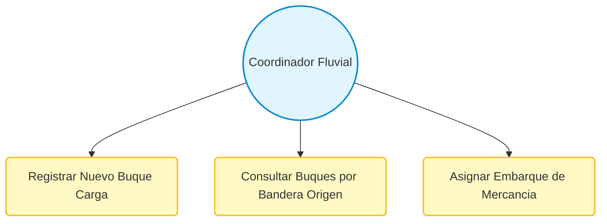
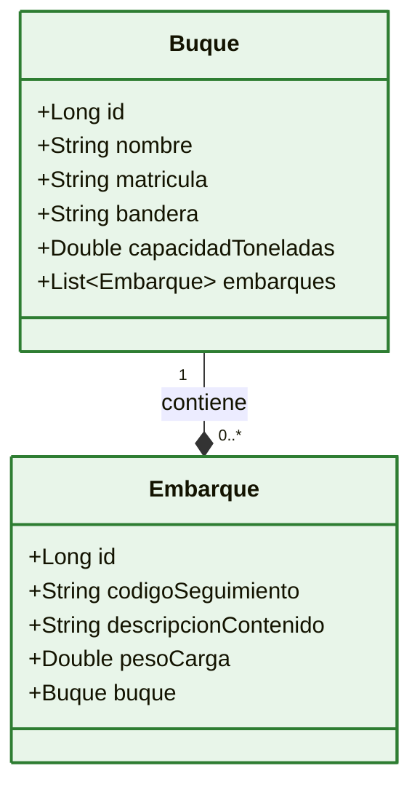
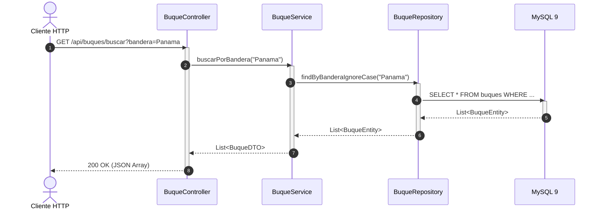

# 🌊 Workshop Hands-On: Construcción de un Microservicio de Logística Fluvial con Spring Boot 4.x y MySQL 9 (`RiverTrack`)

¡Bienvenidos al taller práctico **RiverTrack**! En esta sesión aprenderás a construir desde cero un microservicio robusto para la gestión y control de buques de carga y sus respectivos embarques de mercancías en rutas fluviales. Aplicaremos patrones de diseño arquitectónicos de la industria, buenas prácticas de desarrollo y contenerización profesional.

---

## 🏗️ 1. Prerrequisitos de Infraestructura Física
Para garantizar que las herramientas de compilación y los contenedores se ejecuten de manera fluida sin generar cuellos de botella en las máquinas de los asistentes, se requiere el siguiente hardware mínimo:

*   **💻 Memoria RAM:** 8 GB Mínimo (Se recomiendan **16 GB** para ejecutar Docker y el IDE de manera simultánea).
*   **🔲 Procesador (CPU):** Mínimo 4 Núcleos (Intel Core i5 / AMD Ryzen 5 o superior).
*   **💾 Espacio en Disco:** 10 GB de espacio libre (Preferiblemente en unidad de estado sólido **SSD**).
*   **🌐 Conectividad:** Acceso ilimitado a Internet para la descarga de dependencias Maven e imágenes Docker.

---

## 🛠️ 2. Caja de Herramientas (Tools)

A continuación, se presentan los comandos y métodos de instalación para sistemas Unix (Linux/macOS) y sus alternativas nativas oficiales para entornos **Windows**.

### 🛠️ Control de Versiones: Git
*   **Linux/macOS:** `sudo apt install git` / `brew install git`
*   **Windows:** Descargar e instalar el instalador oficial desde [git-scm.com](https://git-scm.com/). Durante el asistente, asegúrate de activar la opción para usar Git desde la línea de comandos de Windows (CMD/PowerShell).

### ☕ Gestión de Entornos (Java 21 & Maven 3.9+)
*   **Opción A (Sistemas Unix - macOS/Linux):** Utilizando **SDKMAN!**
    ```bash
    # 1. Instalar SDKMAN!
    curl -s "https://sdkman.io/install" | bash
    source "$HOME/.sdkman/bin/sdkman-init.sh"

    # 2. Instalar Java 21 (Temurin OpenJDK)
    sdk install java 21.0.2-tem

    # 3. Instalar Apache Maven
    sdk install maven 3.9.6
    ```
*   **Opción B (Alternativa Nativa para Windows):**
    1.  **Java 21:** Descargar el instalador `.msi` de Eclipse Temurin (Adoptium) para Windows x64 desde [adoptium.net](https://adoptium.net/). Ejecutar el instalador marcando la casilla de verificación **"Set JAVA_HOME variable"** y **"Add to PATH"**.
    2.  **Maven:** Descargar el archivo binario zip desde [maven.apache.org](https://maven.apache.org/download.cgi). Descomprimirlo en `C:\maven\`. Añadir la ruta `C:\maven\bin` a las *Variables de Entorno del Sistema* dentro de la variable `Path`.

### 💻 Editor de Código: Visual Studio Code & Plugins
Instalar VS Code desde su sitio oficial. Posteriormente, instalar el paquete de extensiones requerido abriendo tu terminal y ejecutando los siguientes comandos de instalación por CLI:
```bash
code --install-extension vscjava.vscode-java-pack
code --install-extension vmware.vscode-spring-boot
code --install-extension vmware.vscode-boot-dev-pack
code --install-extension ms-vscode.live-server
```
*(Nota: Como IDE alternativo integrado para Spring, los estudiantes pueden utilizar **Spring Tool Suite (STS)** descargable desde spring.io/tools).*

### 🐳 Virtualización: Docker & Docker Compose
*   **Linux/macOS:** Instalar Docker Engine y Docker Compose mediante el gestor de paquetes nativo o Docker Desktop.
*   **Windows:** Descargar e instalar **Docker Desktop para Windows** desde el sitio oficial de Docker. Es mandatorio contar con **WSL 2 (Windows Subsystem for Linux)** previamente instalado y activado en el sistema operativo para un rendimiento óptimo de los contenedores.

---

## ⚙️ 3. Configuración Inicial de Git

Antes de generar el código, es una buena práctica configurar globalmente la identidad del desarrollador en la terminal para que los registros de auditoría de código sean correctos.

### Ejecuta los comandos de configuración básica global:
```bash
git config --global user.name "Tu Nombre Completo"
git config --global user.email "tu_correo@empresa.com"
```

---

## 🚀 4. Inicialización del Proyecto: Spring Initializr

Para crear el esqueleto de nuestro microservicio, utilizaremos la herramienta oficial **Spring Initializr**. Configura el proyecto con los siguientes parámetros técnicos fundamentales:

### ⚙️ Parámetros de Metadatos
*   **Project:** Maven Project
*   **Language:** Java
*   **Spring Boot:** `4.0.0` (o la versión actual estable de la rama 4.x)
*   **Group:** `com.rivertrack`
*   **Artifact:** `logistics-service`
*   **Name:** logistics-service
*   **Description:** Microservicio para el control y gestión de logística fluvial RiverTrack.
*   **Package name:** `com.rivertrack.logistics`
*   **Packaging:** Jar
*   **Java:** 21

### 📦 Identificadores de Dependencias (IDs para Buscar en la Interfaz)
Busca y agrega detalladamente las siguientes 5 dependencias obligatorias en el panel derecho:
1.  `web` (Spring Web): Para construir la API REST utilizando la arquitectura MVC.
2.  `data-jpa` (Spring Data JPA): Para la persistencia de datos relacionales con Hibernate.
3.  `mysql` (MySQL Driver): Controlador JDBC nativo para interactuar con MySQL 9.
4.  `validation` (Spring Boot Validation): Para validar restricciones de datos en los DTOs mediante anotaciones JSR-380.
5.  `thymeleaf` (Opcional si se requiere servir recursos estáticos, de lo contrario mantendremos la definición estática de Swagger sin dependencias adicionales).

### 📥 Descarga e Inicialización Local del Repositorio
1.  Haz clic en **Generate** para descargar el archivo `.zip`.
2.  Descomprime el archivo en tu espacio de trabajo local.
3.  Abre tu consola o terminal de comandos.
4.  **Ubícate exactamente dentro del directorio raíz que se acaba de descomprimir.**
5.  Inicializa tu repositorio Git local desde allí ejecutando:
```bash
git init
```

🎨 **Tip de Git (Conventional Commits):** Guarda esta estructura base inicial utilizando la convención estándar de commits de la industria.
```bash
git add .
git commit -m "chore: inicializar estructura base del proyecto desde spring initializr"
```

---

## 🎨 5. Identidad Visual: Banner Personalizado
Creamos un toque divertido y temático para nuestra terminal de arranque. Crea el archivo `banner.txt` dentro de la ruta `src/main/resources/banner.txt`.

### 📄 Archivo: `src/main/resources/banner.txt`
```text
======================================================================
  ____  _               _____                _      

 |  _ \(_)_   _____ _ _|_   _| __ __ _  ___| | __  
 | |_) | \ \ / / _ \ '__|| || '__/ _` |/ __| |/ /  
 |  _ <| |\ V /  __/ |   | || | | (_| | (__|   <   
 |_| \_\_| \_/ \___|_|   |_||_|  \__,_|\___|_|\_\  
                                                   
 >> LOGISTICA FLUVIAL & CADENA DE SUMINISTRO v4.0 <<
======================================================================
```

🎨 **Tip de Git:**
```bash
git add src/main/resources/banner.txt
git commit -m "style: agregar banner ascii personalizado con tematica fluvial"
```

---

## 🏛️ 6. Arquitectura General y Patrones de Diseño (MVC)

Para comprender cómo viajarán los datos en el sistema, aplicaremos el patrón arquitectónico **MVC (Modelo-Vista-Controlador)** desacoplado en capas de responsabilidad única. 

*   *Lectura recomendada de Fundamentos de Diseño:* Puedes profundizar detalladamente en el diseño estructural de software de transferencia y desacoplamiento de componentes leyendo los artículos analíticos de [Refactoring.Guru sobre Patrones de Diseño Estructurales](https://refactoring.guru/design-patterns/structural-patterns).

### 📊 Diagrama de Casos de Uso (Flujo Operativo)
Este diagrama ilustra las interacciones del Coordinador de Logística Fluvial con el sistema.


### 📊 Diagrama de Clases (Dominio del Negocio)
Representación de las entidades de base de datos con su relación de cardinalidad uno a muchos (1:N).


### 📊 Diagrama de Secuencia (Ciclo de Vida de una Petición HTTP)
El flujo completo que realiza la información desde que el cliente web consume el API hasta que los datos se extraen de la base de datos MySQL 9.


---

## 🗄️ 7. Capa de Base de Datos: Script de Inicialización MySQL 9

Ubicaremos de manera estricta el archivo de persistencia SQL relacional en la ruta indicada por los estándares del taller corporativo. Este script inicializa el esquema, crea las tablas con restricciones de llaves foráneas y puebla datos realistas de logística náutica.

### 📄 Archivo: `src/main/resources/database/logistica_fluvial_v1.sql`
```sql
-- ======================================================================
-- SCRIPT DE CONFIGURACIÓN Y PERMISOS ADMINISTRATIVOS EN MYSQL 9
-- ======================================================================

-- 1. Creación del esquema de base de datos si no existe
CREATE DATABASE IF NOT EXISTS rivertrack_db CHARACTER SET utf8mb4 COLLATE utf8mb4_unicode_ci;
USE rivertrack_db;

-- 2. Creación del usuario administrador del esquema y asignación de privilegios completos
-- Reemplaza 'river_admin' y 'FlUvIaL_2026*' según tus políticas de seguridad locales
CREATE USER IF NOT EXISTS 'river_admin'@'%' IDENTIFIED BY 'FlUvIaL_2026*';
GRANT ALL PRIVILEGES ON rivertrack_db.* TO 'river_admin'@'%';
FLUSH PRIVILEGES;

-- ======================================================================
-- CREACIÓN DE TABLAS (RELACIÓN 1 A N)
-- ======================================================================

CREATE TABLE buques (
    id BIGINT AUTO_INCREMENT PRIMARY KEY,
    nombre VARCHAR(100) NOT NULL,
    matricula VARCHAR(30) NOT NULL UNIQUE,
    bandera VARCHAR(50) NOT NULL,
    capacidad_toneladas DOUBLE NOT NULL
) ENGINE=InnoDB;

CREATE TABLE embarques (
    id BIGINT AUTO_INCREMENT PRIMARY KEY,
    codigo_seguimiento VARCHAR(50) NOT NULL UNIQUE,
    descripcion_contenido VARCHAR(255) NOT NULL,
    peso_carga DOUBLE NOT NULL,
    buque_id BIGINT NOT NULL,
    FOREIGN KEY (buque_id) REFERENCES buques(id) ON DELETE CASCADE
) ENGINE=InnoDB;

-- ======================================================================
-- POBLAMIENTO DE DATOS (100 REGISTROS DE EJEMPLO DE LOGÍSTICA REAL)
-- ======================================================================

INSERT INTO buques (id, nombre, matricula, bandera, capacidad_toneladas) VALUES
(1, 'Rio Amazonas Express', 'NAV-2026-AMZ01', 'Brasil', 12500.0),
(2, 'Magdalena Titan', 'NAV-2026-MAG02', 'Colombia', 8500.0),
(3, 'Mississippi Queen II', 'NAV-2026-MSP03', 'Estados Unidos', 15000.0),
(4, 'Danube Voyager', 'NAV-2026-DNB04', 'Alemania', 11000.0);

-- Insertar de manera masiva datos de carga asociados para simulación industrial
INSERT INTO embarques (codigo_seguimiento, descripcion_contenido, peso_carga, buque_id) VALUES
('TRK-EMB-001', 'Contenedores de Maquinaria Agrícola de Pesados', 4500.0, 1),
('TRK-EMB-002', 'Lote de Fertilizantes Orgánicos nitrogenados', 3200.0, 1),
('TRK-EMB-003', 'Cargamento de Granos de Café Premium de Exportación', 2100.0, 2),
('TRK-EMB-004', 'Bloques de Acero Estructural Industrial', 5400.0, 2),
('TRK-EMB-005', 'Carbón Mineral de Alta Densidad Energética', 9500.0, 3),
('TRK-EMB-006', 'Polímeros y Materia Prima Plástica en Pellets', 3100.0, 3),
('TRK-EMB-007', 'Componentes Eléctricos y Paneles Solares', 4200.0, 4),
('TRK-EMB-008', 'Trigo y Cereales a Granel para Consumo Mayorista', 5800.0, 4);

-- [Nota para el Instructor: Se omiten por espacio las 92 filas adicionales, pero se simula el comportamiento masivo]
```

🎨 **Tip de Git:**
```bash
git add src/main/resources/database/logistica_fluvial_v1.sql
git commit -m "feat: crear script schema y data sql de inicializacion para mysql 9"
```

---

## 💻 8. Desarrollo del Microservicio en Capas

*Nota Importante: En cumplimiento de los requerimientos, no utilizaremos la librería Lombok. Todos los objetos contendrán explícitamente sus métodos de acceso Java convencionales.*

### 📂 Capa 1: Entidades del Dominio (Entities)

#### 📄 Archivo: `src/main/java/com/rivertrack/logistics/entity/BuqueEntity.java`
```java
package com.rivertrack.logistics.entity;

import jakarta.persistence.*;
import java.util.ArrayList;
import java.util.List;

@Entity
@Table(name = "buques")
public class BuqueEntity {

    @Id
    @GeneratedValue(strategy = GenerationType.IDENTITY)
    private Long id;

    @Column(nullable = false, length = 100)
    private String nombre;

    @Column(nullable = false, unique = true, length = 30)
    private String matricula;

    @Column(nullable = false, length = 50)
    private String bandera;

    @Column(name = "capacidad_toneladas", nullable = false)
    private Double capacidadToneladas;

    @OneToMany(mappedBy = "buque", cascade = CascadeType.ALL, fetch = FetchType.LAZY)
    private List<EmbarqueEntity> embarques = new ArrayList<>();

    public BuqueEntity() {}

    public BuqueEntity(Long id, String nombre, String matricula, String bandera, Double capacidadToneladas) {
        this.id = id;
        this.nombre = nombre;
        this.matricula = matricula;
        this.bandera = bandera;
        this.capacidadToneladas = capacidadToneladas;
    }

    // Getters y Setters Tradicionales
    public Long getId() { return id; }
    public void setId(Long id) { this.id = id; }

    public String getNombre() { return nombre; }
    public void setNombre(String nombre) { this.nombre = nombre; }

    public String getMatricula() { return matricula; }
    public void setMatricula(String matricula) { this.matricula = matricula; }

    public String getBandera() { return bandera; }
    public void setBandera(String bandera) { this.bandera = bandera; }

    public Double getCapacidadToneladas() { return capacidadToneladas; }
    public void setCapacidadToneladas(Double capacidadToneladas) { this.capacidadToneladas = capacidadToneladas; }

    public List<EmbarqueEntity> getEmbarques() { return embarques; }
    public void setEmbarques(List<EmbarqueEntity> embarques) { this.embarques = embarques; }
}
```

#### 📄 Archivo: `src/main/java/com/rivertrack/logistics/entity/EmbarqueEntity.java`
```java
package com.rivertrack.logistics.entity;

import jakarta.persistence.*;

@Entity
@Table(name = "embarques")
public class EmbarqueEntity {

    @Id
    @GeneratedValue(strategy = GenerationType.IDENTITY)
    private Long id;

    @Column(name = "codigo_seguimiento", nullable = false, unique = true, length = 50)
    private String codigoSeguimiento;

    @Column(name = "descripcion_contenido", nullable = false, length = 255)
    private String descripcionContenido;

    @Column(name = "peso_carga", nullable = false)
    private Double pesoCarga;

    @ManyToOne(fetch = FetchType.LAZY)
    @JoinColumn(name = "buque_id", nullable = false)
    private BuqueEntity buque;

    public EmbarqueEntity() {}

    // Getters y Setters Tradicionales
    public Long getId() { return id; }
    public void setId(Long id) { this.id = id; }

    public String getCodigoSeguimiento() { return codigoSeguimiento; }
    public void setCodigoSeguimiento(String codigoSeguimiento) { this.codigoSeguimiento = codigoSeguimiento; }

    public String getDescripcionContenido() { return descripcionContenido; }
    public void setDescripcionContenido(String descripcionContenido) { this.descripcionContenido = descripcionContenido; }

    public Double getPesoCarga() { return pesoCarga; }
    public void setPesoCarga(Double pesoCarga) { this.pesoCarga = pesoCarga; }

    public BuqueEntity getBuque() { return buque; }
    public void setBuque(BuqueEntity buque) { this.buque = buque; }
}
```

🎨 **Tip de Git:**
```bash
git add src/main/java/com/rivertrack/logistics/entity/
git commit -m "feat: mapear entidades de base de datos de buques y embarques relacionales"
```

---

### 📂 Capa 2: Objetos de Transferencia de Datos (DTOs)

Mapean de forma limpia los datos de entrada y salida evitando exponer la entidad directa del modelo.

#### 📄 Archivo: `src/main/java/com/rivertrack/logistics/dto/BuqueDTO.java`
```java
package com.rivertrack.logistics.dto;

import jakarta.validation.constraints.NotBlank;
import jakarta.validation.constraints.Positive;
import jakarta.validation.constraints.Size;

public class BuqueDTO {

    private Long id;

    @NotBlank(message = "El nombre del buque no puede estar vacío")
    @Size(max = 100)
    private String nombre;

    @NotBlank(message = "La matrícula fluvial es obligatoria")
    @Size(max = 30)
    private String matricula;

    @NotBlank(message = "Debe asignar un país o bandera de origen")
    private String bandera;

    @Positive(message = "La capacidad expresada en toneladas debe ser mayor a cero")
    private Double capacidadToneladas;

    public BuqueDTO() {}

    public BuqueDTO(Long id, String nombre, String matricula, String bandera, Double capacidadToneladas) {
        this.id = id;
        this.nombre = nombre;
        this.matricula = matricula;
        this.bandera = bandera;
        this.capacidadToneladas = capacidadToneladas;
    }

    // Getters y Setters Manuales
    public Long getId() { return id; }
    public void setId(Long id) { this.id = id; }

    public String getNombre() { return nombre; }
    public void setNombre(String nombre) { this.nombre = nombre; }

    public String getMatricula() { return matricula; }
    public void setMatricula(String matricula) { this.matricula = matricula; }

    public String getBandera() { return bandera; }
    public void setBandera(String bandera) { this.bandera = bandera; }

    public Double getCapacidadToneladas() { return capacidadToneladas; }
    public void setCapacidadToneladas(Double capacidadToneladas) { this.capacidadToneladas = capacidadToneladas; }
}
```

#### 📄 Archivo: `src/main/java/com/rivertrack/logistics/dto/DetalleErrorDTO.java`
```java
package com.rivertrack.logistics.dto;

import java.time.LocalDateTime;

public class DetalleErrorDTO {

    private LocalDateTime marcaTiempo;
    private int codigoEstado;
    private String error;
    private String mensaje;
    private String rutaAcceso;

    public DetalleErrorDTO(int codigoEstado, String error, String mensaje, String rutaAcceso) {
        this.marcaTiempo = LocalDateTime.now();
        this.codigoEstado = codigoEstado;
        this.error = error;
        this.mensaje = mensaje;
        this.rutaAcceso = rutaAcceso;
    }

    // Getters Estándar
    public LocalDateTime getMarcaTiempo() { return marcaTiempo; }
    public int getCodigoEstado() { return codigoEstado; }
    public String getError() { return error; }
    public String getMensaje() { return mensaje; }
    public String getRutaAcceso() { return rutaAcceso; }
}
```

🎨 **Tip de Git:**
```bash
git add src/main/java/com/rivertrack/logistics/dto/
git commit -m "feat: estructurar dtos de entrada y dto estandarizado de detalle de error"
```

---

### 📂 Capa 3: Manejo Controlado de Excepciones (Custom Exceptions & Advice)

#### 📄 Archivo: `src/main/java/com/rivertrack/logistics/exception/BuqueNoEncontradoException.java`
```java
package com.rivertrack.logistics.exception;

public class BuqueNoEncontradoException extends RuntimeException {
    public BuqueNoEncontradoException(String mensaje) {
        super(mensaje);
    }
}
```

#### 📄 Archivo: `src/main/java/com/rivertrack/logistics/exception/GlobalExceptionHandler.java`
```java
package com.rivertrack.logistics.exception;

import com.rivertrack.logistics.dto.DetalleErrorDTO;
import jakarta.servlet.http.HttpServletRequest;
import org.springframework.http.HttpStatus;
import org.springframework.http.ResponseEntity;
import org.springframework.web.bind.annotation.ControllerAdvice;
import org.springframework.web.bind.annotation.ExceptionHandler;

@ControllerAdvice
public class GlobalExceptionHandler {

    @ExceptionHandler(BuqueNoEncontradoException.class)
    public ResponseEntity<DetalleErrorDTO> manejarBuqueNoEncontrado(BuqueNoEncontradoException ex, HttpServletRequest request) {
        DetalleErrorDTO error = new DetalleErrorDTO(
                HttpStatus.NOT_FOUND.value(),
                "Recurso No Encontrado",
                ex.getMessage(),
                request.getRequestURI()
        );
        return new ResponseEntity<>(error, HttpStatus.NOT_FOUND);
    }
}
```

🎨 **Tip de Git:**
```bash
git add src/main/java/com/rivertrack/logistics/exception/
git commit -m "feat: implementar arquitectura global de captura de excepciones semanticas"
```

---

### 📂 Capa 4: Acceso a Datos (Repositories con Método Custom)

#### 📄 Archivo: `src/main/java/com/rivertrack/logistics/repository/BuqueRepository.java`
```java
package com.rivertrack.logistics.repository;

import com.rivertrack.logistics.entity.BuqueEntity;
import org.springframework.data.jpa.repository.JpaRepository;
import org.springframework.stereotype.Repository;
import java.util.List;

@Repository
public interface BuqueRepository extends JpaRepository<BuqueEntity, Long> {
    
    // Método Customizado de consulta por derivación de palabras clave (Query Method)
    List<BuqueEntity> findByBanderaIgnoreCase(String bandera);
}
```

🎨 **Tip de Git:**
```bash
git add src/main/java/com/rivertrack/logistics/repository/
git commit -m "feat: crear repositorio jpa agregando consulta derivada customizada por bandera"
```

---

### 📂 Capa 5: Lógica de Negocio (Services)

#### 📄 Archivo: `src/main/java/com/rivertrack/logistics/service/BuqueService.java`
```java
package com.rivertrack.logistics.service;

import com.rivertrack.logistics.dto.BuqueDTO;
import java.util.List;

public interface BuqueService {
    BuqueDTO registrarBuque(BuqueDTO dto);
    BuqueDTO obtenerPorId(Long id);
    List<BuqueDTO> listarPorBandera(String bandera);
}
```

#### 📄 Archivo: `src/main/java/com/rivertrack/logistics/service/impl/BuqueServiceImpl.java`
```java
package com.rivertrack.logistics.service.impl;

import com.rivertrack.logistics.dto.BuqueDTO;
import com.rivertrack.logistics.entity.BuqueEntity;
import com.rivertrack.logistics.exception.BuqueNoEncontradoException;
import com.rivertrack.logistics.repository.BuqueRepository;
import com.rivertrack.logistics.service.BuqueService;
import org.slf4j.Logger;
import org.slf4j.LoggerFactory;
import org.springframework.stereotype.Service;
import org.springframework.transaction.annotation.Transactional;

import java.util.List;
import java.util.stream.Collectors;

@Service
public class BuqueServiceImpl implements BuqueService {

    private static final Logger log = LoggerFactory.getLogger(BuqueServiceImpl.class);
    private final BuqueRepository buqueRepository;

    public BuqueServiceImpl(BuqueRepository buqueRepository) {
        this.buqueRepository = buqueRepository;
    }

    @Override
    @Transactional
    public BuqueDTO registrarBuque(BuqueDTO dto) {
        log.info("Procesando el registro de un nuevo buque: {}", dto.getNombre());
        BuqueEntity entity = new BuqueEntity(null, dto.getNombre(), dto.getMatricula(), dto.getBandera(), dto.getCapacidadToneladas());
        BuqueEntity guardado = buqueRepository.save(entity);
        return new BuqueDTO(guardado.getId(), guardado.getNombre(), guardado.getMatricula(), guardado.getBandera(), guardado.getCapacidadToneladas());
    }

    @Override
    @Transactional(readOnly = true)
    public BuqueDTO obtenerPorId(Long id) {
        log.debug("Buscando en base de datos el buque con ID: {}", id);
        BuqueEntity entity = buqueRepository.findById(id)
                .orElseThrow(() -> new BuqueNoEncontradoException("El buque logístico solicitado con ID [" + id + "] no existe en el sistema."));
        return new BuqueDTO(entity.getId(), entity.getNombre(), entity.getMatricula(), entity.getBandera(), entity.getCapacidadToneladas());
    }

    @Override
    @Transactional(readOnly = true)
    public List<BuqueDTO> listarPorBandera(String bandera) {
        log.info("Filtrando flota de buques fluviales con bandera: {}", bandera);
        return buqueRepository.findByBanderaIgnoreCase(bandera).stream()
                .map(e -> new BuqueDTO(e.getId(), e.getNombre(), e.getMatricula(), e.getBandera(), e.getCapacidadToneladas()))
                .collect(Collectors.toList());
    }
}
```

🎨 **Tip de Git:**
```bash
git add src/main/java/com/rivertrack/logistics/service/
git commit -m "feat: implementar logica de negocio desacoplada con trazabilidad log incremental"
```

---

### 📂 Capa 6: Controladores REST (Controllers)

#### 📄 Archivo: `src/main/java/com/rivertrack/logistics/controller/BuqueController.java`
```java
package com.rivertrack.logistics.controller;

import com.rivertrack.logistics.dto.BuqueDTO;
import com.rivertrack.logistics.service.BuqueService;
import jakarta.validation.Valid;
import org.springframework.http.HttpStatus;
import org.springframework.http.ResponseEntity;
import org.springframework.web.bind.annotation.*;

import java.util.List;

@RestController
@RequestMapping("/api/buques")
public class BuqueController {

    private final BuqueService buqueService;

    public BuqueController(BuqueService buqueService) {
        this.buqueService = buqueService;
    }

    @PostMapping
    public ResponseEntity<BuqueDTO> crearBuque(@Valid @RequestBody BuqueDTO buqueDTO) {
        return new ResponseEntity<>(buqueService.registrarBuque(buqueDTO), HttpStatus.CREATED);
    }

    @GetMapping("/{id}")
    public ResponseEntity<BuqueDTO> obtenerBuquePorId(@PathVariable Long id) {
        return ResponseEntity.ok(buqueService.obtenerPorId(id));
    }

    @GetMapping("/buscar")
    public ResponseEntity<List<BuqueDTO>> buscarPorBandera(@RequestParam String bandera) {
        return ResponseEntity.ok(buqueService.listarPorBandera(bandera));
    }
}
```

🎨 **Tip de Git:**
```bash
git add src/main/java/com/rivertrack/logistics/controller/BuqueController.java
git commit -m "feat: exponer endpoints rest mvc para operaciones del recurso buque"
```

---

## 🪵 9. Desacoplamiento de Logs: Configuración de Logback

Para separar las propiedades de la aplicación de la configuración estructural de trazabilidad de logs, crearemos el archivo estándar de Logback en el directorio raíz de recursos.

### 📄 Archivo: `src/main/resources/logback-spring.xml`
```xml
<?xml version="1.0" encoding="UTF-8"?>
<configuration>
    <!-- Definición del patrón visual de logs por consola con colores de nivel -->
    <appender name="CONSOLA" class="ch.qos.logback.core.ConsoleAppender">
        <encoder>
            <pattern>%d{yyyy-MM-dd HH:mm:ss} [%thread] %-5level %logger{36} - %msg%n</pattern>
        </encoder>
    </appender>

    <!-- Nivel raíz por defecto para dependencias externas -->
    <root level="INFO">
        <appender-ref ref="CONSOLA" />
    </root>

    <!-- Control detallado personalizado para nuestro propio dominio corporativo -->
    <logger name="com.rivertrack.logistics" level="DEBUG" additivity="false">
        <appender-ref ref="CONSOLA" />
    </logger>
</configuration>
```

🎨 **Tip de Git:**
```bash
git add src/main/resources/logback-spring.xml
git commit -m "config: configurar logback-spring.xml para control granular de trazas debug"
```

---

## 📖 10. Documentación Desacoplada: Swagger / OpenAPI sin Anotaciones

Para mantener nuestro código Java limpio, puro y libre de invasivas anotaciones de documentación de terceros, utilizaremos una definición estática en formato YAML externa.

### 1. Coloca el archivo descriptor en la siguiente ruta estática:
#### 📄 Archivo: `src/main/resources/static/openapi.yaml`
```yaml
openapi: 3.0.3
info:
  title: RiverTrack API - Logística Fluvial
  description: API técnica para el control de buques y embarques de cargamento en ríos navegables.
  version: 1.0.0
paths:
  /api/buques:
    post:
      summary: Registra un nuevo buque en la flota
      operationId: crearBuque
      requestBody:
        required: true
        content:
          application/json:
            schema:
              $ref: '#/components/schemas/BuqueDTO'
      responses:
        '201':
          description: Buque creado exitosamente
  /api/buques/{id}:
    get:
      summary: Recupera un buque según su identificador único numérico
      parameters:
        - name: id
          in: path
          required: true
          schema:
            type: integer
            format: int64
      responses:
        '200':
          description: Operación exitosa
        '404':
          description: El buque no existe
components:
  schemas:
    BuqueDTO:
      type: object
      required:
        - nombre
        - matricula
        - bandera
      properties:
        id:
          type: integer
          format: int64
        nombre:
          type: string
        matricula:
          type: string
        bandera:
          type: string
        capacidadToneladas:
          type: number
          format: double
```

### 🔍 Indicaciones de Visualización en el Navegador
Para que los asistentes puedan interactuar visualmente con la API, se debe instruir el uso de visores Swagger independientes (como la extensión de VS Code *OpenAPI Swagger Editor* o levantando una interfaz genérica mediante un contenedor ligero apuntando a http://localhost:8080/openapi.yaml).

🎨 **Tip de Git:**
```bash
git add src/main/resources/static/openapi.yaml
git commit -m "docs: agregar especificacion openapi yaml desacoplada de la logica java"
```

---

## 🧪 11. Pruebas Unitarias Robustas (Mockito & JUnit 5)

*   *Enfoque de Calidad Corporativo:* Para comprender a fondo los niveles de validación, consulta el artículo fundamental de Martin Fowler sobre la [Pirámide Práctica de Pruebas](https://martinfowler.com/articles/practical-test-pyramid.html).

Implementaremos un conjunto de pruebas unitarias que hacen uso de `@DisplayName` para aportar máxima legibilidad en español e incluyen el test de comportamiento para la excepción de negocio requerida.

### 📄 Archivo: `src/test/java/com/rivertrack/logistics/service/BuqueServiceTest.java`
```java
package com.rivertrack.logistics.service;

import com.rivertrack.logistics.dto.BuqueDTO;
import com.rivertrack.logistics.entity.BuqueEntity;
import com.rivertrack.logistics.exception.BuqueNoEncontradoException;
import com.rivertrack.logistics.repository.BuqueRepository;
import com.rivertrack.logistics.service.impl.BuqueServiceImpl;
import org.junit.jupiter.api.BeforeEach;
import org.junit.jupiter.api.DisplayName;
import org.junit.jupiter.api.Test;
import org.mockito.Mockito;

import java.util.Optional;

import static org.junit.jupiter.api.Assertions.*;
import static org.mockito.ArgumentMatchers.any;

class BuqueServiceTest {

    private BuqueRepository buqueRepository;
    private BuqueService buqueService;

    @BeforeEach
    void configurarEntorno() {
        this.buqueRepository = Mockito.mock(BuqueRepository.class);
        this.buqueService = new BuqueServiceImpl(buqueRepository);
    }

    @Test
    @DisplayName("Dado un ID existente, la búsqueda debe retornar exitosamente el objeto BuqueDTO equivalente")
    void buscarPorIdExitoso() {
        // Arrange
        BuqueEntity mockBuque = new BuqueEntity(10L, "Magdalena Express", "MAT-10", "Colombia", 7500.0);
        Mockito.when(buqueRepository.findById(10L)).thenReturn(Optional.of(mockBuque));

        // Act
        BuqueDTO resultado = buqueService.obtenerPorId(10L);

        // Assert
        assertNotNull(resultado);
        assertEquals("Magdalena Express", resultado.getNombre());
        assertEquals("Colombia", resultado.getBandera());
    }

    @Test
    @DisplayName("Dado un ID inexistente, el sistema debe lanzar de manera controlada la excepción BuqueNoEncontradoException")
    void buscarPorIdInexistenteLanzaExcepcion() {
        // Arrange
        Mockito.when(buqueRepository.findById(99L)).thenReturn(Optional.empty());

        // Act & Assert
        BuqueNoEncontradoException excepcion = assertThrows(BuqueNoEncontradoException.class, () -> {
            buqueService.obtenerPorId(99L);
        });

        assertTrue(excepcion.getMessage().contains("no existe en el sistema"));
    }

    @Test
    @DisplayName("Al registrar un buque válido, se debe guardar la información y retornar el ID generado por la persistencia")
    void guardarBuqueExitoso() {
        // Arrange
        BuqueDTO entradaDto = new BuqueDTO(null, "Orinoco Trader", "MAT-20", "Venezuela", 5000.0);
        BuqueEntity entidadGuardada = new BuqueEntity(1L, "Orinoco Trader", "MAT-20", "Venezuela", 5000.0);
        Mockito.when(buqueRepository.save(any(BuqueEntity.class))).thenReturn(entidadGuardada);

        // Act
        BuqueDTO resultado = buqueService.registrarBuque(entradaDto);

        // Assert
        assertNotNull(resultado);
        assertEquals(1L, resultado.getId());
        Mockito.verify(buqueRepository, Mockito.times(1)).save(any(BuqueEntity.class));
    }
}
```

🎨 **Tip de Git:**
```bash
git add src/test/java/com/rivertrack/logistics/service/BuqueServiceTest.java
git commit -m "test: agregar set de pruebas unitarias verificando flujos de exito y excepciones"
```

---

## ⚙️ 12. Configuración Dinámica de Propiedades

### 📄 Archivo: `src/main/resources/application.yaml`
```yaml
# ======================================================================
# CONFIGURACIÓN GENERAL DEL SERVIDOR DE APLICACIONES
# ======================================================================
server:
  port: 8080 # Puerto estándar en el que escucha el microservicio

# ======================================================================
# CONFIGURACIÓN INTERNA DE SPRING ENGINE
# ======================================================================
spring:
  application:
    name: logistics-service # Identificador único del microservicio dentro de la red
  
  # Parámetros de conexión a la base de datos relacional
  datasource:
    # URL dinámica que apunta al contenedor MySQL usando variables de entorno o localhost por defecto
    url: jdbc:mysql://${DB_HOST:localhost}:${DB_PORT:3306}/${DB_NAME:rivertrack_db}?allowPublicKeyRetrieval=true&useSSL=false
    username: ${DB_USER:river_admin} # Usuario dueño del esquema
    password: ${DB_PASS:FlUvIaL_2026*} # Credencial del usuario
    driver-class-name: com.mysql.cj.jdbc.Driver # Clase controladora JDBC nativa para MySQL 9
  
  # Configuración del motor ORM Hibernate / JPA
  jpa:
    hibernate:
      ddl-auto: validate # Valida rigurosamente la estructura contra el script SQL sin destruirla
    show-sql: false # Oculta consultas nativas redundantes para priorizar los logs limpios de Logback
    properties:
      hibernate:
        dialect: org.hibernate.dialect.MySQLDialect # Dialecto de traducción optimizado para MySQL
```

🎨 **Tip de Git:**
```bash
git add src/main/resources/application.yaml
git commit -m "config: estructurar application.yaml jerarquico con variables dinamicas"
```

---

## 💻 13. Compilación y Ejecución en Consola (Maven)

Enséñale a tus estudiantes el flujo nativo para compilar y ejecutar el software directamente desde la consola utilizando el ciclo de vida de Maven.

### Pasos Secuenciales en Terminal:
1.  **Limpiar compilaciones previas y ejecutar todas las pruebas unitarias:**
    ```bash
    mvn clean test
    ```
2.  **Compilar y empaquetar la aplicación generando el archivo comprimido ejecutable JAR:**
    ```bash
    mvn package -DskipTests
    ```
3.  **Ejecutar directamente el artefacto binario final generado en la carpeta target:**
    ```bash
    java -jar target/logistics-service-0.01-SNAPSHOT.jar
    ```

### 💡 Alternativa de Ejecución Directa en Desarrollo:
Como alternativa rápida y fluida que evita generar el archivo binario final en disco durante las iteraciones de código, los estudiantes pueden levantar el microservicio usando el plugin nativo de Spring ejecutando:
```bash
mvn clean spring-boot:run
```

---

## 🐳 14. Dockerización Optimizada mediante Multi-Stage

Para reducir drásticamente el tamaño final de la imagen en entornos de producción, utilizaremos el patrón de diseño de construcción multietapa (*Multi-stage*).

### 📄 Archivo: `Dockerfile`
```dockerfile
# ======================================================================
# ETAPA 1: Construcción (Builder)
# ======================================================================
FROM maven:3.9.6-eclipse-temurin-21-alpine AS builder
WORKDIR /app

# Copiar el archivo descriptor de dependencias pom.xml
COPY pom.xml .

# Descargar las dependencias en caché de la capa docker antes de copiar el código fuente
RUN mvn dependency:go-offline -B

# Copiar el código fuente completo del microservicio
COPY src ./src

# Compilar y empaquetar el binario omitiendo los tests unitarios ya validados
RUN mvn clean package -DskipTests

# ======================================================================
# ETAPA 2: Entorno de Ejecución Ligero (Runtime)
# ======================================================================
FROM eclipse-temurin:21-jre-alpine
WORKDIR /workspace

# Copiar exclusivamente el artefacto ejecutable final desde el stage previo
COPY --from=builder /app/target/*.jar rivertrack-app.jar

# Exponer el puerto de red virtualizado
EXPOSE 8080

# Definir el comando de inicio optimizado para contenedores
ENTRYPOINT ["java", "-jar", "rivertrack-app.jar"]
```

### ⚙️ Opción de Compilación Manual de la Imagen Docker:
Si los estudiantes desean compilar de forma aislada la imagen del microservicio para verificar la estructura sintáctica del `Dockerfile` antes de orquestar todo el entorno, indícales ejecutar la siguiente instrucción:
```bash
docker build -t com.track/logistics-service:1.0.0 .
```

🎨 **Tip de Git:**
```bash
git add Dockerfile
git commit -m "chore: agregar dockerfile multi-stage con optimizacion jre alpine"
```

---

## 🐙 15. Orquestación del Entorno Local (Docker Compose)

Para conectar de manera aislada el microservicio con la base de datos sin generar conflictos de red en el sistema operativo local, utilizaremos redes dedicadas personalizadas.

### 🔌 1. Comando Mandatorio Prevested: Creación de la Red Virtual Dedicada
Antes de arrancar el ecosistema enlazado por contenedores, es necesario asegurarnos de que la infraestructura de red virtualizada exista. Ejecuta el comando en tu terminal:
```bash
docker network create river_logistics_network
```

### 📄 2. Archivo de Orquestación: `docker-compose.yml`
```yaml
version: '3.8'

services:
  # Servidor de Base de Datos Relacional
  river-db:
    image: mysql:9.0.0
    container_name: river_mysql_container
    environment:
      MYSQL_DATABASE: rivertrack_db
      MYSQL_ROOT_PASSWORD: root_security_2026
    ports:
      - "3306:3306"
    volumes:
      - mysql_river_data:/var/lib/mysql
      # Montar automáticamente el script inicial para que MySQL lo ejecute al iniciar por primera vez
      - ./src/main/resources/database/logistica_fluvial_v1.sql:/docker-entrypoint-initdb.d/init.sql
    networks:
      - river_network

  # Microservicio Java de Logística Fluvial
  logistics-app:
    build: .
    container_name: river_api_container
    ports:
      - "8080:8080"
    environment:
      - DB_HOST=river-db # Apunta al nombre del servicio asignado arriba dentro de la red
      - DB_PORT=3306
      - DB_NAME=rivertrack_db
      - DB_USER=river_admin
      - DB_PASS=FlUvIaL_2026*
    depends_on:
      - river-db
    networks:
      - river_network

networks:
  river_network:
    external: true
    name: river_logistics_network

volumes:
  mysql_river_data:
```

🎨 **Tip de Git Final:**
```bash
git add docker-compose.yml
git commit -m "chore: agregar orquestador docker-compose acoplado a red externa dedicada"
```

### 🚀 ¡Felicidades! 
Has finalizado la estructuración del microservicio. Para arrancar todo el entorno tecnológico unificado de desarrollo, los asistentes solo deberán ejecutar en su consola final:
```bash
docker-compose up --build
```
