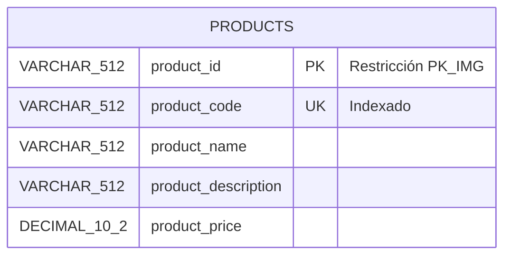
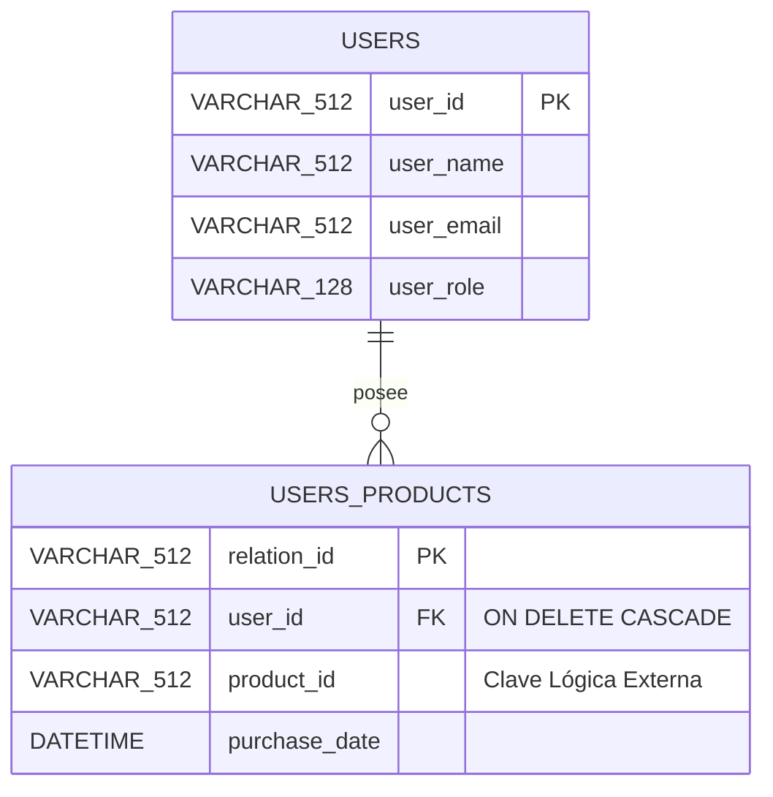
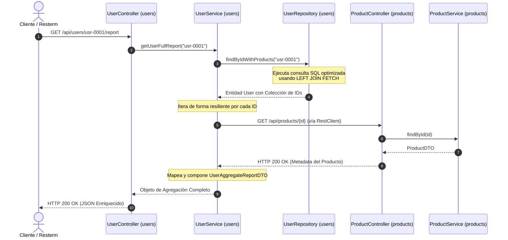

# 🚀 Workshop: Arquitectura de Microservicios Distribuidos con Spring Boot 3.x & MySQL

¡Bienvenido al repositorio central del Workshop! En este laboratorio práctico aprenderás a construir, integrar y desplegar un ecosistema distribuido compuesto por **dos aplicaciones backend e independientes**, cada una con su propia base de datos dedicada, aplicando patrones profesionales de comunicación HTTP, resiliencia defensiva, pruebas automatizadas y control de calidad.

---

## 🏗️ 1. Arquitectura General y Topología de Red

El sistema implementa de forma estricta el patrón arquitectónico **Database-per-Microservice**. No existen llaves foráneas (`FOREIGN KEY`) cruzadas entre servidores MySQL independientes; la consistencia e integridad referencial de los datos distribuidos se gestiona en la capa de software a través de orquestación síncrona.

```mermaid
graph TD
    subgraph 💻 Entorno Máquina Real Host
        UI[📱 Cliente HTTP / Resterm] -->|Puerto Local 8080| AppProducts
        UI -->|Puerto Local 8081| AppUsers
    end

    subgraph 🌐 Red Docker: workshop_shared_network Bridge
        subgraph 👥 Microservicio Usuarios Puerto 8081
            AppUsers[Spring Boot: users]
            DBUsers[(🐬 MySQL: usersdb <br> Contenedor: mysql_server_users)]
            AppUsers -->|localhost:3306 <br> network_mode| DBUsers
        end

        subgraph 📦 Microservicio Productos Puerto 8080
            AppProducts[Spring Boot: products]
            DBProducts[(🐬 MySQL: productsdb <br> Contenedor: mysql_server_products)]
            AppProducts -->|localhost:3306 <br> network_mode| DBProducts
        end
    end

    %% Comunicación Distribuida
    AppUsers -->|1. RestClient GET /api/products/{id}| AppProducts

    style Microservicio Usuarios fill:#f9f,stroke:#333,stroke-width:2px
    style Microservicio Productos fill:#bbf,stroke:#333,stroke-width:2px
```

### 📡 Lección Clave de Infraestructura: Redes en DevContainers
Durante el taller descubrimos que el uso de `network_mode: service:[db]` en los entornos de desarrollo DevContainer acopla las pilas de red del contenedor de Java y su base de datos local de la siguiente forma:
1. **Host `localhost` interno**: El microservicio y su MySQL local comparten la misma interfaz. Spring Boot se conecta de forma nativa a `localhost:3306`. Los puertos mapeados externos (como el `3308`) son **exclusivos para herramientas externas de la máquina física** y fallan si se intentan usar de forma interna.
2. **Descubrimiento de Servicios Externos**: Para romper el aislamiento de los proyectos, se utiliza la red común de Docker `workshop_shared_network`. La aplicación de usuarios localiza a la API de productos apuntando al nombre del contenedor que aloja su red compartida (`http://mysql_server_products:8080`).

---

## 🗄️ 2. Diseño y Modelo de Datos Decentralizado

### Servidor de Productos (`productsdb`)
Contiene el catálogo e inventario general de objetos.


### Servidor de Usuarios (`usersdb`)
Gestiona clientes y sus transacciones locales de compra de forma aislada.


---

## 🔄 3. Diagrama de Secuencia: Consulta Unificada por ID

Este flujo describe la optimización implementada para recuperar el reporte detallado del usuario sin necesidad de descargar todo el catálogo del inventario de forma masiva:



---

## ⚙️ 4. Guía de Configuración Global del Entorno

### Prerrequisito: Crear la Red Compartida en tu Computadora Real
Antes de inicializar los DevContainers en VS Code, debes crear de forma manual la red virtual en la terminal de tu sistema operativo principal para permitir la comunicación inter-servicio:
```bash
docker network create workshop_shared_network
```

### Configuración del Entorno de Usuarios (`users/src/main/resources/application.yaml`)
```yaml
server:
  port: 8081
spring:
  application:
    name: users
  datasource:
    url: jdbc:mysql://localhost:3306/\${DB_NAME:usersdb}?useSSL=false&serverTimezone=UTC
    username: \${DB_USER:workshop}
    password: \${DB_PASSWORD:workshop2026}
  jpa:
    hibernate:
      ddl-auto: validate
    properties:
      hibernate:
        physical_naming_strategy: org.hibernate.boot.model.naming.PhysicalNamingStrategyStandardImpl

# 🚀 URL del Contenedor de la API Externa en la red común de Docker
api:
  products:
    url: \${PRODUCTS_API_URL:http://mysql_server_products:8080/api/products}
```

---

## 🧪 5. Control de Calidad y Pruebas con Resterm

Hemos separado los archivos de pruebas funcionales interactivas para simular un ambiente de entrega continua real. Puedes ejecutarlos desde la consola integrada utilizando **Resterm**:

### Módulo de Productos (`products.http`)
* Validaciones básicas de endpoints REST de catálogos.
* Pruebas del cursor del Procedimiento Almacenado de nombres concatenados (`sp_listar_nombres_productos`).
* Inserciones masivas nativas eludiendo la caché de Hibernate.

### Módulo de Usuarios (`users.http`)
* Verificación del comportamiento del Procedimiento Almacenado local (`sp_obtener_metricas_usuario`).
* Pruebas de orquestación síncrona por ID con transformación dinámica de strings a JSON nativo (`JSON.parse(response.body)`).
* Simulación de fallos controlados por excepciones personalizadas de negocio (`UserBusinessException`) retornando códigos de error unificados **`HTTP 422 Unprocessable Content`**.

### Ejecución de Ciclo Completo en Java (JaCoCo Metrics)
Ambos microservicios cuentan con el plugin de JaCoCo configurado para romper la compilación si no se cumplen las políticas de pruebas automáticas (80% líneas / 70% ramas). Para correr los tests unitarios, integrales con Testcontainers y reportes en frío:
```bash
mvn clean verify
```

---

## 📦 6. Compilación de Imágenes Docker (Entorno de Producción)

Para empaquetar de forma segura y eficiente los microservicios utilizando los Dockerfiles multi-etapa independientes, ejecuta los siguientes comandos desde la terminal de tu máquina física (fuera de los DevContainers):

```bash
# 1. Compilar la imagen del Microservicio de Productos
cd ./products
docker build \
  --no-cache \
  --build-arg BUILD_DATE=$(date -u +'%Y-%m-%dT%H:%M:%SZ') \
  --build-arg BUILD_VERSION="1.0.0" \
  --build-arg BUILD_REVISION=$(git rev-parse --short HEAD 2>/dev/null || echo "unknown") \
  -t workshop/products-service:latest .


# 2. Compilar la imagen del Microservicio de Usuarios
cd ../users
docker build \
  --build-arg BUILD_DATE=\$(date -u +'%Y-%m-%dT%H:%M:%SZ') \
  --build-arg BUILD_VERSION="1.0.0" \
  --build-arg BUILD_REVISION=\$(git rev-parse --short HEAD 2>/dev/null || echo "unknown") \
  -t users-service:latest .
```

---

## 🐳 7. Orquestación y Despliegue con Docker Compose

Una vez compiladas las imágenes locales, regresa a la raíz de tu espacio de trabajo global para levantar y administrar la infraestructura completa del ecosistema distribuido (las 2 aplicaciones ejecutándose en paralelo junto con sus 2 servidores MySQL dedicados).

### Comandos de Operación:

* **Levantar todos los servicios en segundo plano (Detached Mode):**
  ```bash
  docker compose -f docker-compose.production.yaml up -d
  ```

* **Verificar el estado de salud y mapeo de puertos de los contenedores:**
  ```bash
  docker compose -f docker-compose.production.yaml ps
  ```

* **Inspeccionar los logs en tiempo real (Útil para auditar la inyección de la variable PRODUCTS_API_URL):**
  ```bash
  # Ver actividad general
  docker compose -f docker-compose.production.yaml logs -f
  
  # Ver actividad exclusiva del microservicio de usuarios
  docker logs -f microservice_users_app
  ```

* **Apagar la arquitectura completa y eliminar los volúmenes persistentes de datos:**
  ```bash
  docker compose -f docker-compose.production.yaml down -v
  ```
