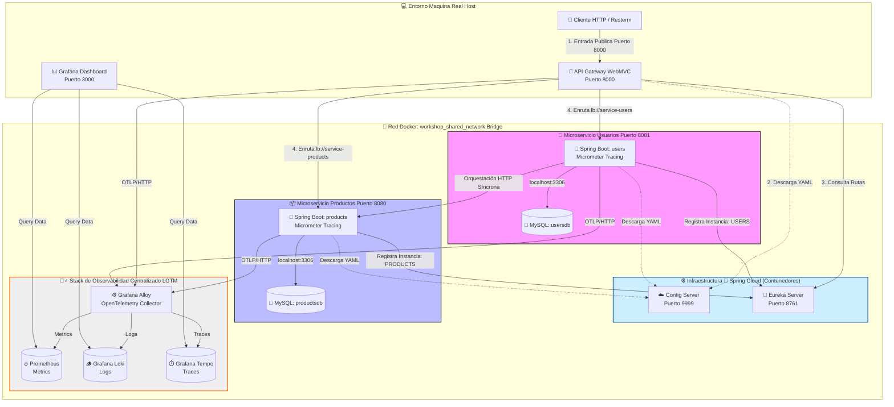
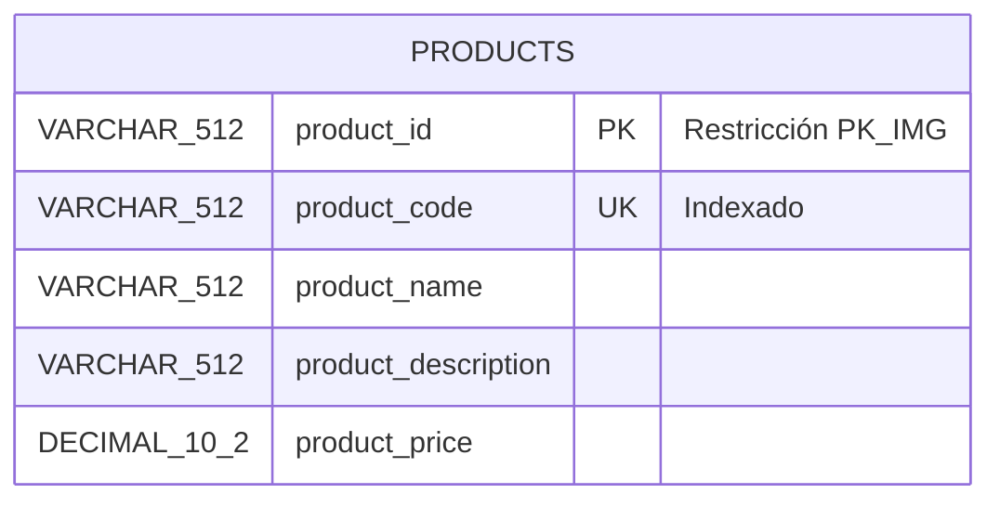
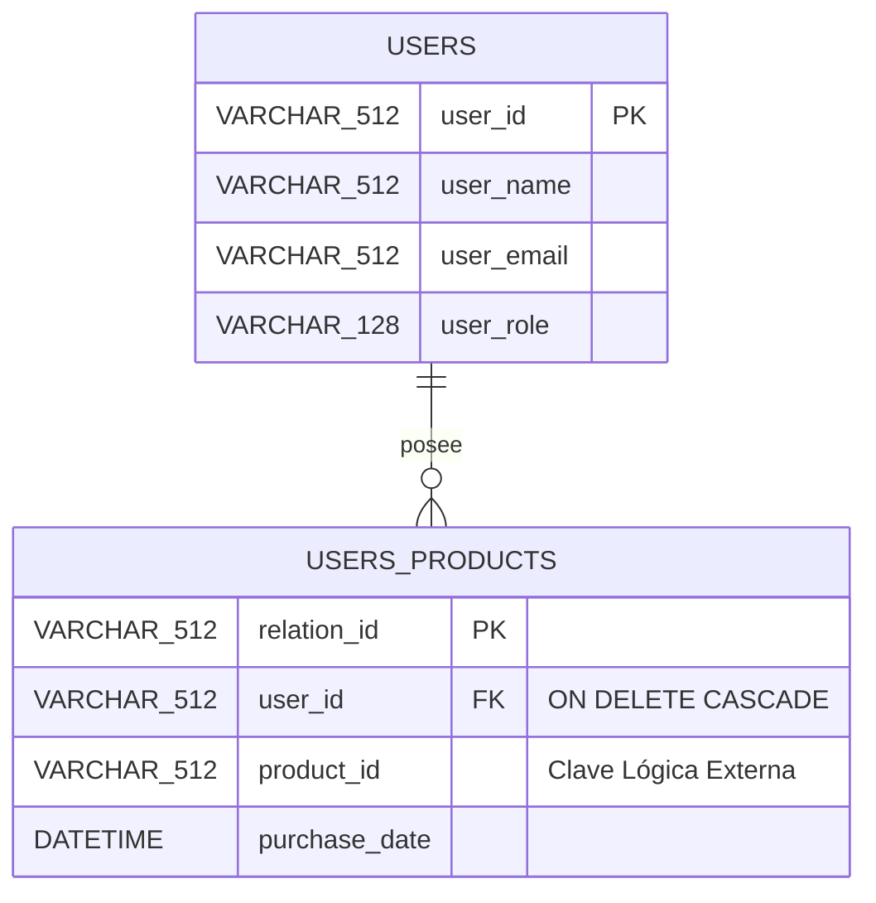
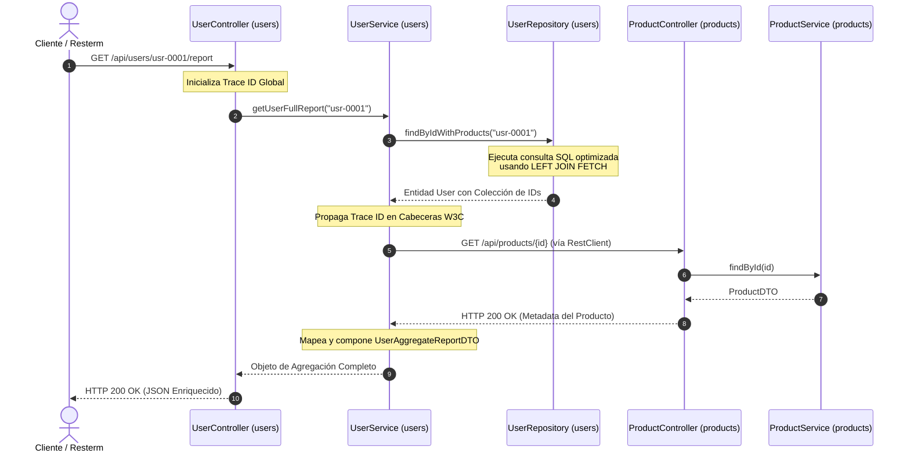

# 🚀 Workshop: Arquitectura de Microservicios Distribuidos con Spring Boot 3.x & MySQL

¡Bienvenido al repositorio central del Workshop! En este laboratorio práctico aprenderás a construir, integrar y desplegar un ecosistema distribuido compuesto por **dos aplicaciones backend e independientes**, cada una con su propia base de datos dedicada, aplicando patrones profesionales de comunicación HTTP, resiliencia defensiva, pruebas automatizadas, control de calidad y **observabilidad nativa de nivel corporativo (LGTM Stack + Grafana Alloy)**.

---

## 🏗️ 1. Arquitectura General y Topología de Red

El sistema implementa de forma estricta el patrón arquitectónico **Database-per-Microservice**. No existen llaves foráneas (`FOREIGN KEY`) cruzadas entre servidores MySQL independientes; la consistencia e integridad referencial de los datos distribuidos se gestiona en la capa de software a través de orquestación síncrona.

El ecosistema está completamente instrumentado de forma nativa (sin agentes pesados de transformación de bytecode) para enviar métricas, logs y trazas distribuidas hacia **Grafana Alloy**, el cual actúa como el recolector y distribuidor único hacia el stack de almacenamiento de Grafana.



### 📡 Lección Clave de Infraestructura: Redes en DevContainers

Durante el taller descubrimos que el uso de `network_mode: service:[db]` en los entornos de desarrollo DevContainer acopla las pilas de red del contenedor de Java y su base de datos local de la siguiente forma:

1. **Host `localhost` interno**: El microservicio y su MySQL local comparten la misma interfaz. Spring Boot se conecta de forma nativa a `localhost:3306`. Los puertos mapeados externos (como el `3308`) son **exclusivos para herramientas externas de la máquina física** y fallan si se intentan usar de forma interna.
2. **Descubrimiento de Servicios Externos**: Para romper el aislamiento de los proyectos, se utiliza la red común de Docker `workshop_shared_network`. La aplicación de usuarios localiza a la API de productos apuntando al nombre del contenedor que aloja su red compartida (`http://mysql_server_products:8080`).

---

## 🕵️‍♂️ 2. Arquitectura de Observabilidad Avanzada (Grafana LGTM Stack)

El ecosistema integra la especificación moderna de **Pruebas y Sistemas Observables** eludiendo el uso de agentes de alteración de bytecode en caliente, mitigando penalizaciones de CPU en pruebas de carga extremas de k6.

- **Grafana Alloy (Collector):** Actúa como el recolector centralizado de telemetría dentro de la red virtual de Docker. Oye en un único punto los datos formateados bajo el estándar **OpenTelemetry (OTLP)**.
- **Prometheus (Métricas):** Almacena las series temporales de consumo de memoria de la JVM, comportamiento de hilos de Tomcat y conteo de peticiones HTTP raspadas de forma eficiente por Alloy.
- **Grafana Loki (Logs):** Centraliza las trazas de consola e hilos de ejecución de Spring Boot inyectados dinámicamente mediante el appender de Logback.
- **Grafana Tempo (Trazas Distribuidas):** Reconstruye el viaje en cascada de una petición asignándole un identificador único global (`Trace ID`). Permite auditar visualmente los milisegundos exactos consumidos entre el orquestador de usuarios, la red de Docker y el catálogo de productos.

---

## 🗄️ 3. Diseño y Modelo de Datos Decentralizado

### Servidor de Productos (`productsdb`)

Contiene el catálogo e inventario general de objetos.



### Servidor de Usuarios (`usersdb`)

Gestiona clientes y sus transacciones locales de compra de forma aislada.



---

## 🔄 4. Diagrama de Secuencia: Consulta Unificada por ID

Este flujo describe la orquestación distribuida que es auditada en tiempo real por el stack de telemetría de Grafana Tempo cuando se genera tráfico masivo:



---

## ⚙️ 5. Guía de Configuración Global del Entorno

### Prerrequisito: Crear la Red Compartida en tu Computadora Real

Antes de inicializar los DevContainers en VS Code, debes crear de forma manual la red virtual en la terminal de tu sistema operativo principal para permitir la comunicación inter-servicio y el enganche de los contenedores de monitoreo:

```bash
docker network create workshop_shared_network
```

### Configuración del Entorno de Usuarios (`users/src/main/resources/application.yaml`)

El archivo base centralizado implementa el patrón **Multi-Document** estructurado con tres guiones (`---`) para aislar los entornos locales del perfil de contenedores en producción sin corromper el classpath de compilación:

```yaml
server:
  port: 8081
spring:
  application:
    name: users-service
  profiles:
    active: \${SPRING_PROFILES_ACTIVE:dev}
  jpa:
    show-sql: true
    properties:
      hibernate:
        physical_naming_strategy: org.hibernate.boot.model.naming.PhysicalNamingStrategyStandardImpl

# 🕵️‍♂️ Configuración Nativa de Observabilidad para Grafana Alloy via OTLP
management:
  tracing:
    sampling:
      probability: 1.0
  otlp:
    metrics:
      export:
        enabled: false
    tracing:
      endpoint: \${OTEL_EXPORTER_OTLP_ENDPOINT:http://localhost:4318/v1/traces}

---
# 🚀 PERFIL DE DESARROLLO LOCAL (dev)
spring:
  config:
    activate:
      on-profile: dev
  datasource:
    url: jdbc:mysql://localhost:3306/\${DB_NAME:usersdb}?useSSL=false&serverTimezone=UTC
    username: \${DB_USER:workshop}
    password: \${DB_PASSWORD:workshop2026}
api:
  products:
    url: http://localhost:8080/api/products

---
# 🐳 PERFIL DE CONTENEDORES EN PRODUCCIÓN (prod)
spring:
  config:
    activate:
      on-profile: prod
  datasource:
    url: jdbc:mysql://localhost:3306/\${DB_NAME:usersdb}?useSSL=false&serverTimezone=UTC
    username: \${DB_USER}
    password: \${DB_PASSWORD}
api:
  products:
    url: http://microservice_products_app:8080/api/products
```

---

## 🧪 6. Control de Calidad y Pruebas con Resterm

Hemos separado los archivos de pruebas funcionales interactivas para simular un ambiente de entrega continua real. Puedes ejecutarlos desde la consola integrada utilizando **Resterm**:

### Módulo de Productos (`products.http`)

- Validaciones básicas de endpoints REST de catálogos.
- Pruebas del cursor del Procedimiento Almacenado de nombres concatenados (`sp_listar_nombres_productos`).
- Inserciones masivas nativas eludiendo la caché de Hibernate.

### Módulo de Usuarios (`users.http`)

- Verificación del comportamiento del Procedimiento Almacenado local (`sp_obtener_metricas_usuario`).
- Pruebas de orquestación síncrona por ID con transformación dinámica de strings a JSON nativo (`JSON.parse(response.body)`).
- Simulación de fallos controlados por excepciones personalizadas de negocio (`UserBusinessException`) retornando códigos de error unificados **`HTTP 422 Unprocessable Content`**.

### Ejecución de Ciclo Completo en Java (JaCoCo Metrics)

Ambos microservicios cuentan con el plugin de JaCoCo configurado para romper la compilación si no se cumplen las políticas de pruebas automáticas (80% líneas / 70% ramas). Para correr los tests unitarios, integrales con Testcontainers y reportes en frío:

```bash
mvn clean verify
```

---

## 📦 7. Compilación de Imágenes Docker (Entorno de Producción)

Para empaquetar de forma segura y eficiente los microservicios utilizando los Dockerfiles multi-etapa basados en la extracción de descompresión nativa (`jar -xf`), ejecuta los siguientes comandos desde la terminal de tu máquina física (fuera de los DevContainers):

```bash
# 1. Compilar la imagen del Microservicio de Productos
cd ./products
docker build \
  --no-cache \
  --build-arg BUILD_DATE=\$(date -u +'%Y-%m-%dT%H:%M:%SZ') \
  --build-arg BUILD_VERSION="1.0.0" \
    --build-arg BUILD_REVISION=$(git rev-parse --short HEAD 2>/dev/null || echo "unknown") \
  -t workshop/products-service:latest .

# 2. Compilar la imagen del Microservicio de Usuarios
cd ../users
docker build \
  --no-cache \
  --build-arg BUILD_DATE=\$(date -u +'%Y-%m-%dT%H:%M:%SZ') \
  --build-arg BUILD_VERSION="1.0.0" \
  --build-arg BUILD_REVISION=$(git rev-parse --short HEAD 2>/dev/null || echo "unknown") \
  -t workshop/users-service:latest .

cd ../config-server
docker build \
  --no-cache \
  --build-arg BUILD_DATE=$(date -u +'%Y-%m-%dT%H:%M:%SZ') \
  --build-arg BUILD_VERSION="1.0.0" \
  --build-arg BUILD_REVISION=$(git rev-parse --short HEAD 2>/dev/null || echo "unknown") \
  -t workshop/config-server:latest .

cd ../eureka-server
docker build \
  --no-cache \
  --build-arg BUILD_DATE=\$(date -u +'%Y-%m-%dT%H:%M:%SZ') \
  --build-arg BUILD_VERSION="1.0.0" \
  --build-arg BUILD_REVISION=$(git rev-parse --short HEAD 2>/dev/null || echo "unknown") \
  -t workshop/eureka-server:latest .

cd ../api-gateway
docker build \
  --no-cache \
  --build-arg BUILD_DATE=\$(date -u +'%Y-%m-%dT%H:%M:%SZ') \
  --build-arg BUILD_VERSION="1.0.0" \
  --build-arg BUILD_REVISION=$(git rev-parse --short HEAD 2>/dev/null || echo "unknown") \
  -t workshop/api-gateway:latest .
```
