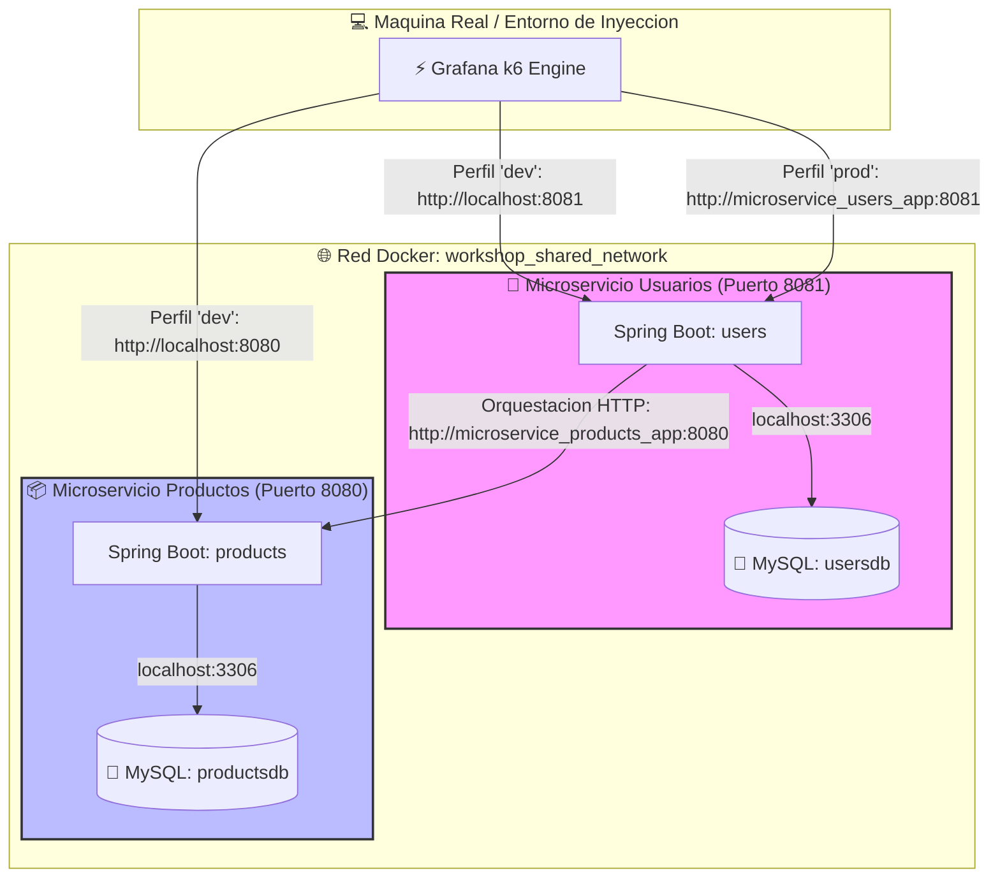
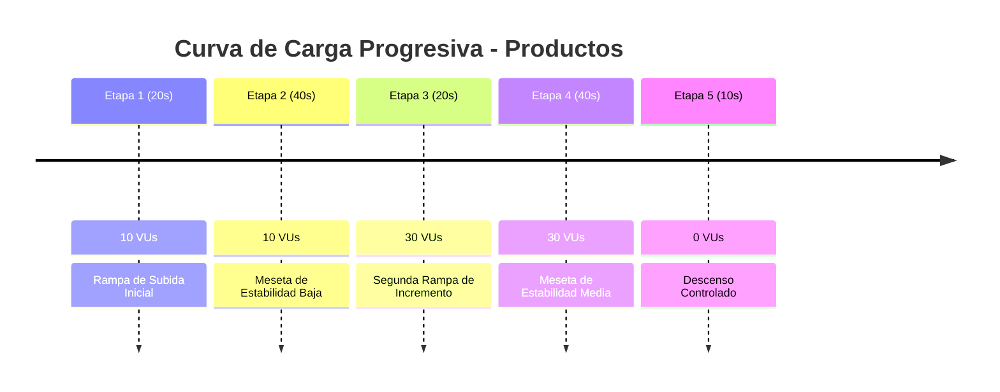
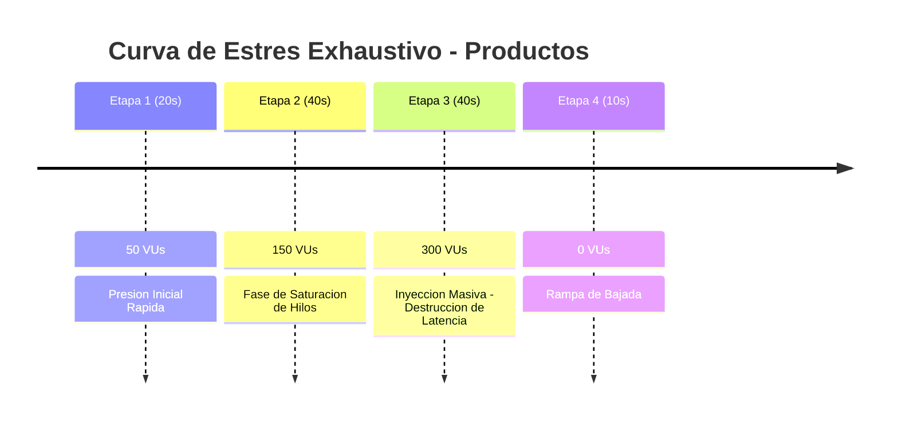
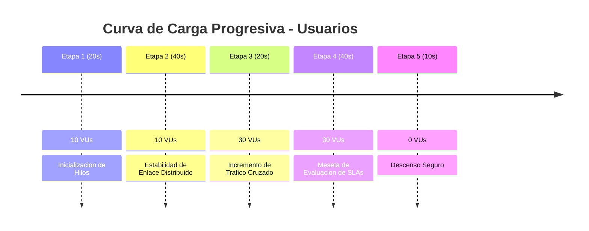
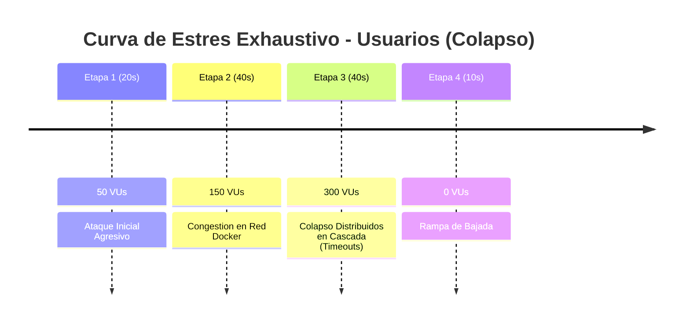

# ⚡ Suite de Pruebas de Rendimiento y Estrés Exhaustivo (k6)

Este directorio contiene la suite centralizada de pruebas de rendimiento, carga y estrés destructivo construida sobre **Grafana k6** para validar la elasticidad, latencia y puntos de quiebre de nuestra arquitectura distribuida de microservicios.

---

## 🏗️ 1. Topología del Entorno de Pruebas

El siguiente diagrama detalla cómo la herramienta k6 actúa como un inyector de tráfico externo y cómo se altera la resolución de red según el perfil seleccionado, interactuando con ambos microservicios en simultáneo:



---

## 📂 2. Estructura del Framework (Tests-as-Code)

La suite está organizada bajo las mejores prácticas corporativas de SRE, aislando el modelo de comunicación de las APIs (Clientes REST) de las configuraciones de hardware y las curvas de inyección de usuarios virtuales (Escenarios).

```text
performance/
├── config/
│   └── environments.js           # Mapeo dinámico de perfiles de red (dev / prod)
├── data/                         # Repositorio para archivos CSV / JSON de datos masivos
├── reports/                      # Almacenamiento automatizado de Reportes HTML interactivos
├── run-tests.sh                  # Script de automatización global compatible con Bash y Zsh
├── src/
│   └── rest/
│       ├── products/             # Contexto Delimitado: Catálogo de Productos
│       │   ├── products.client.js # Cliente HTTP de productos (GET, POST, DELETE)
│       │   └── scenarios/        # Escenarios lógicos de inyección de carga
│       │       ├── products-load.test.js
│       │       └── products-stress.test.js
│       └── users/                # Contexto Delimitado: Gestión de Usuarios y Compras
│           ├── users.client.js   # Cliente HTTP de usuarios (GET Reporte por ID)
│           └── scenarios/        # Escenarios de orquestación distribuida
│               ├── users-load.test.js
│               └── users-stress.test.js
└── utils/                        # Funciones utilitarias y manejadores globales
```

---

## ⚙️ 3. Arquitectura de Entornos de Ejecución

k6 lee dinámicamente la variable de entorno del sistema operativo `TEST_ENV` a través de su constante interna global `__ENV`. Contamos con dos entornos simétricos alineados a la infraestructura del taller:

- **`dev` (Desarrollo Local / DevContainer):** Direcciona el tráfico directamente hacia el `localhost` y puertos expuestos de la máquina del programador (`localhost:8080` / `localhost:8081`). Activado por defecto.
- **`prod` (Producción / Docker Compose):** Direcciona el tráfico hacia los nombres de dominio internos de los contenedores en la red virtual compartida de Docker (`microservice_products_app` / `microservice_users_app`), ideal para pruebas con contención física de hardware.

---

## 📦 4. Módulo 1: Catálogo de Productos (`products`)

Este módulo valida el comportamiento del microservicio encargado de los inventarios. El cliente REST (`products.client.js`) gestiona las cabeceras e inyecta UUIDs aleatorios dinámicos en las operaciones de escritura para eludir las restricciones de clave duplicada en MySQL.

### A. Escenario 1: Carga Progresiva Moderada (`products-load.test.js`)

Evalúa el rendimiento frente a curvas de tráfico tradicionales con rampas escalonadas de hasta **30 usuarios virtuales (VUs)** simultáneos, simulando el "tiempo de pensamiento" mediante una pausa de 1 segundo (`sleep(1)`).



### B. Escenario 2: Estrés Exhaustivo al Límite - Punto de Quiebre (`products-stress.test.js`)

Prueba de asfixia destructiva. Remueve el `sleep` para enviar ráfagas continuas e inyecta **300 usuarios virtuales concurrentes** con el fin de saturar los hilos de Tomcat bajo la contención física de hardware de Docker Compose.



---

## 👥 5. Módulo 2: Gestión de Usuarios (`users`)

Este módulo evalúa la **orquestación distribuida en cascada**. Al atacar el endpoint de reportes agregados, el microservicio de usuarios procesa su procedimiento almacenado local (`sp_obtener_metricas_usuario`) y, simultáneamente, realiza llamadas HTTP síncronas hacia el catálogo de productos.

### A. Escenario 1: Carga Progresiva Moderada (`users-load.test.js`)

Mide la latencia base de la comunicación inter-servicio combinando consultas de base de datos relacional y peticiones síncronas bajo una curva escalonada de hasta **30 usuarios virtuales concurrentes**.



### B. Escenario 2: Estrés Exhaustivo en Cascada (`users-stress.test.js`)

**Ataque masivo y destructivo sin pausas (`sleep`).** Al inyectar **300 usuarios virtuales simultáneos**, ambos contenedores limitados a 256MB de RAM y 0.50 CPU compiten al límite por recursos. Provoca un atasco en los hilos de Tomcat y desbordamientos en el Garbage Collector (ZGC), disparando excepciones de tiempo de espera (`502 / 504 Gateway Timeout`) demostrando el punto de colapso a nivel software.



---

## 🚀 6. Automatización del Laboratorio (`run-tests.sh`)

Para simplificar la ejecución del taller, contamos con un script automatizado multiplataforma con un menú interactivo. Gestiona de forma transparente la detección de shell (**Bash / Zsh**) para la lectura de teclado y permite activar el **Web Dashboard integrado** de Grafana k6 (v0.49.0+) para generar reportes interactivos HTML de forma nativa en la carpeta `reports/`.

### Instrucciones de Operación:

1. **Otorgar permisos de ejecución al script desde tu terminal física:**
   ```bash
   chmod +x run-tests.sh
   ```
2. **Iniciar el menú interactivo:**
   ```bash
   ./run-tests.sh
   ```
3. **Monitoreo en vivo de recursos (Abrir en una terminal secundaria dividida):**
   ```bash
   docker stats prod-app-products prod-app-users
   ```
4. **Ver los logs de colapso en tiempo real:**
   ```bash
   docker logs -f microservice_users_app
   ```
