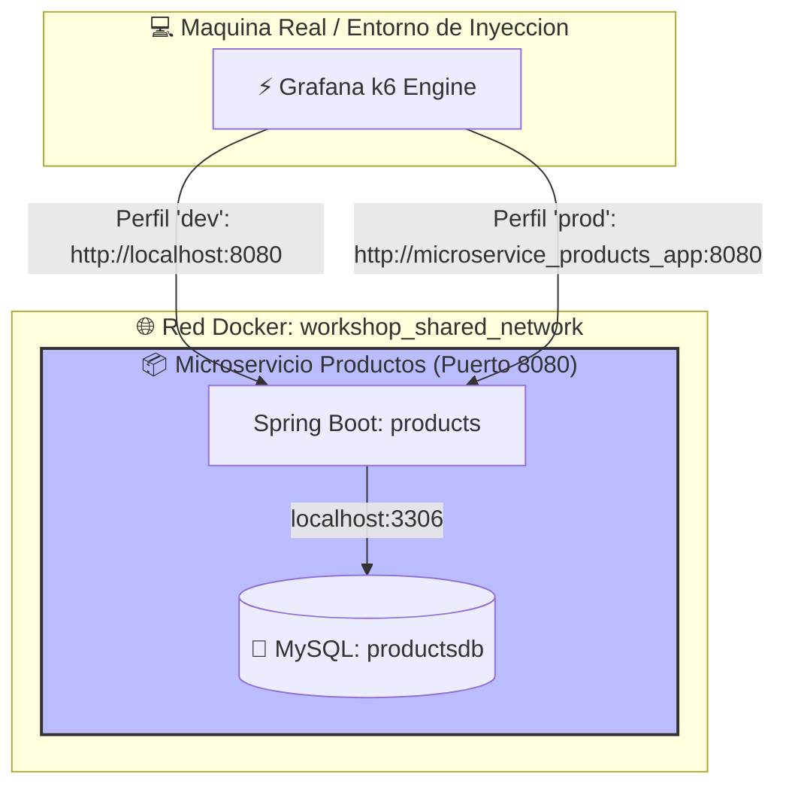
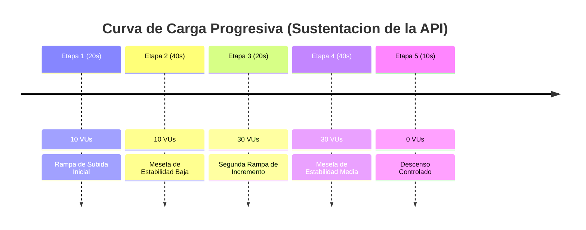

# ⚡ Suite de Pruebas de Rendimiento y Estrés Exhaustivo (k6)

Este directorio contiene la suite centralizada de pruebas de rendimiento, carga y estrés destructivo construida sobre **Grafana k6** para validar la elasticidad, latencia y puntos de quiebre de nuestra arquitectura distribuida de microservicios.

---

## 🏗️ 1. Topología del Entorno de Pruebas

El siguiente diagrama detalla cómo la herramienta k6 actúa como un inyector de tráfico externo y cómo se altera la resolución de red según el perfil seleccionado:



---

## 📂 2. Estructura del Framework (Tests-as-Code)

La suite está organizada bajo las mejores prácticas corporativas de SRE, aislando el modelo de comunicación de las APIs (Clientes REST) de las configuraciones de hardware y las curvas de inyección de usuarios virtuales (Escenarios).

```text
performance/
├── config/
│   └── environments.js           # Mapeo dinámico de perfiles de red (dev / prod)
├── data/                         # Repositorio para archivos CSV / JSON de datos masivos
├── reports/                      # Almacenamiento automatizado de Reportes HTML interactivos
├── run-tests.sh                  # Script de automatización global de la suite
├── src/
│   └── rest/
│       ├── products/             # Contexto Delimitado: Catálogo de Productos
│       │   ├── products.client.js # Cliente HTTP síncrono y reutilizable
│       │   └── scenarios/        # Curvas de carga y estrés destructivo
│       │       ├── products-load.test.js
│       │       └── products-stress.test.js
│       └── users/                # Contexto Delimitado: Gestión de Usuarios (Pendiente)
└── utils/                        # Funciones utilitarias y manejadores globales
```

---

## ⚙️ 3. Arquitectura de Entornos de Ejecución

k6 lee dinámicamente la variable de entorno del sistema operativo `TEST_ENV` a través de su constante interna global `__ENV`. Contamos con dos entornos simétricos alineados a la infraestructura del taller:

- **`dev` (Desarrollo Local / DevContainer):** Direcciona el tráfico directamente hacia el `localhost` y puertos expuestos de la máquina del programador (`localhost:8080`). Activado por defecto.
- **`prod` (Producción / Docker Compose):** Direcciona el tráfico hacia el nombre de dominio interno del contenedor en la red virtual de Docker (`microservice_products_app:8080`), ideal para pruebas con contención física de hardware.

---

## 📦 4. Módulo 1: Catálogo de Productos (`products`)

Este módulo valida el comportamiento del microservicio encargado de los inventarios. El cliente REST (`products.client.js`) gestiona de forma síncrona las cabeceras corporativas y descompone las operaciones del ciclo de vida del catálogo.

### A. Escenario 1: Carga Progresiva Moderada (`products-load.test.js`)

Evalúa el comportamiento de la API frente a curvas de tráfico tradicionales con rampas escalonadas de hasta **30 usuarios virtuales (VUs)** simultáneos, simulando el "tiempo de pensamiento" (_think time_) de un cliente real mediante una pausa de 1 segundo (`sleep(1)`).



#### 🚀 Comandos de Ejecución (Elegir Entorno):

```bash
# Ejecutar en ambiente de desarrollo local (dev)
k6 run src/rest/products/scenarios/products-load.test.js -e TEST_ENV=dev

# Ejecutar en ambiente de contenedores de producción (prod)
k6 run src/rest/products/scenarios/products-load.test.js -e TEST_ENV=prod
```

---

### B. Escenario 2: Estrés Exhaustivo al Límite - Punto de Quiebre (`products-stress.test.js`)

**Prueba de asfixia destructiva.** Está diseñada para ejecutarse sobre el entorno `prod` aplicando la contención de recursos de Docker (CPU topado en **0.50 hilos** y RAM restringida a **256MB** con `docker-compose.stress.yaml`).

El script remueve el `sleep` para enviar ráfagas de peticiones continuas sin tregua e inyecta **300 usuarios virtuales concurrentes** con el fin de saturar los hilos de Tomcat y forzar el colapso del sistema por software.


#### 🚀 Comandos de Ejecución con Reporte Visual Integrado (Web Dashboard):

Aprovechando la característica nativa de k6 (v0.49.0+), podemos exportar la telemetría interactiva de Grafana a un archivo HTML físico inyectando variables en la terminal de la máquina real:

```bash
# Lanzar ataque de estrés generando el reporte en la carpeta unificada
K6_WEB_DASHBOARD=true \
K6_WEB_DASHBOARD_EXPORT=reports/products-stress-report.html \
k6 run src/rest/products/scenarios/products-stress.test.js -e TEST_ENV=prod
```

_Nota: Mientras la prueba esté corriendo, se puede abrir el navegador web en `http://localhost:5665` para auditar las gráficas de latencia del percentil `p(95)` y rendimiento por segundo (RPS) en vivo._

---

## 👥 5. Módulo 2: Gestión de Usuarios (`users`)

_(Sección en construcción. Pendiente de definición de flujos distribuidos y orquestación síncrona por ID con el cliente de k6)._
