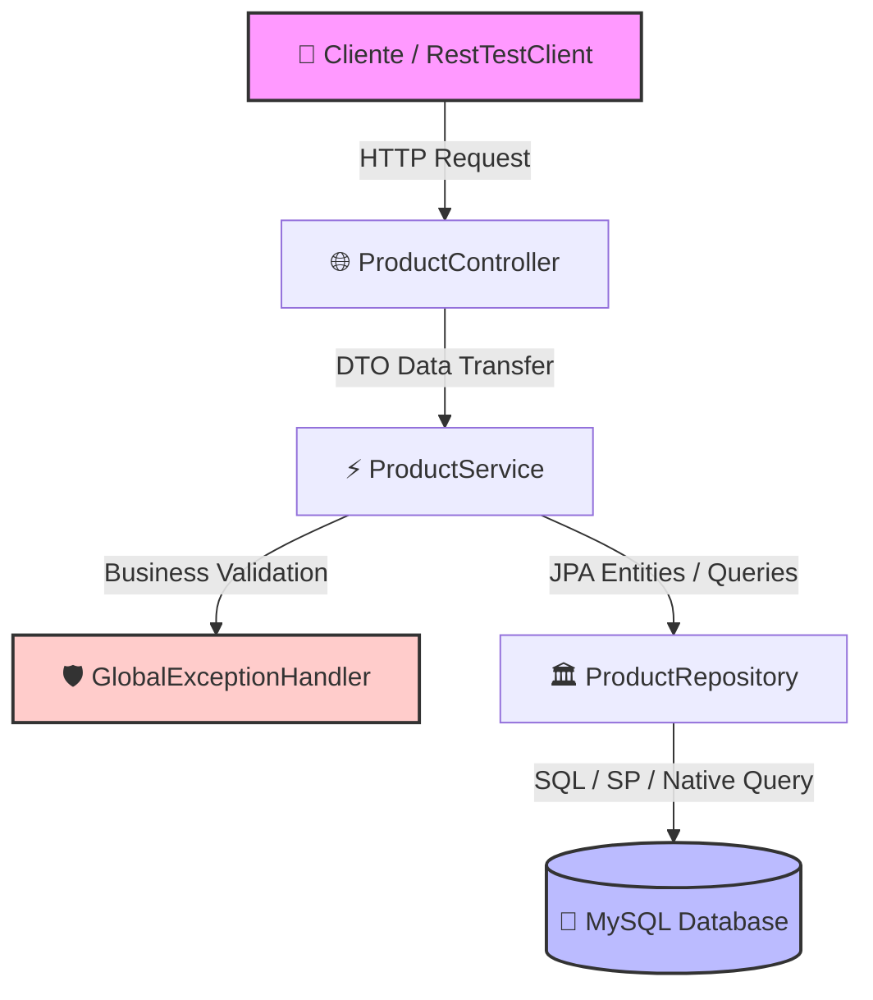
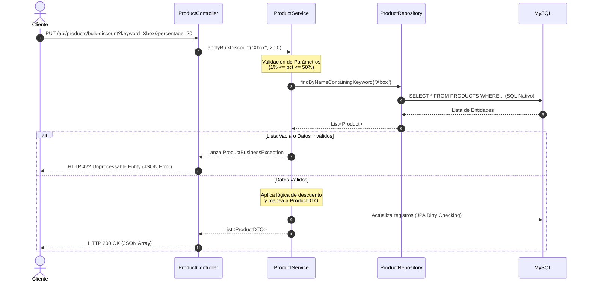

# 🚀 Workshop: Desarrollo Backend Profesional con Spring Boot & MySQL

¡Bienvenido al laboratorio práctico! El objetivo de este workshop es construir, asegurar y probar una API REST robusta utilizando una arquitectura limpia en capas, aplicando reglas de negocio complejas, consultas nativas, manejo global de excepciones y métricas de calidad de código.

---

## 🏗️ 1. Arquitectura del Sistema

A continuación se muestra el flujo de datos desde el cliente HTTP hasta la base de datos MySQL, pasando por las capas de abstracción de Spring Framework:



### Diagrama de Secuencia: Flujo de la Regla de Negocio
Este es el ciclo de vida de la ejecución para el endpoint de descuento masivo temporal:



---

## 📋 2. Guía de Laboratorio Paso a Paso (Cheat Sheet)

Sigue esta secuencia lógica para construir el proyecto desde cero junto al instructor:

### Paso 1: Inicialización y Estructura
1. Genera el proyecto en [start.spring.io](https://spring.io) con: **Java 17+**, **Spring Web**, **Spring Data JPA**, y **MySQL Driver**.
2. Estructura tus paquetes bajo la raíz `com.example.products`:
   * `controller`, `service`, `repository`, `entity`, `dto`, `exception`.

### Paso 2: Configuración del Entorno (`application.yml` & Logback)
1. Configura tus credenciales de base de datos en `src/main/resources/application.yml`.
2. Agrega el archivo `logback-spring.xml` para activar el rastreo detallado de parámetros e instrucciones SQL de Hibernate.

### Paso 3: Mapeo de Datos (Capa persistence)
1. Diseña la entidad `Product.java` asegurando que la clave primaria coincida con la restricción `PK_IMG` del script SQL.
2. Define el `ProductDTO.java` usando un `record` de Java para inmutabilidad extrema.
3. Configura las consultas dirigidas en `ProductRepository.java`:
   * `@Procedure` para el cursor del procedimiento almacenado.
   * `@Query(nativeQuery = true)` para la paginación de bajo nivel.

### Paso 4: Lógica de Negocio y Control de Errores (Capa Core)
1. Construye tu clase de excepción de negocio `ProductBusinessException.java`.
2. Implementa los métodos transaccionales en `ProductService.java` aplicando las reglas de validación previas a la base de datos.
3. Centraliza tus respuestas HTTP fallidas creando un `@RestControllerAdvice` para eliminar el código repetitivo de captura en tus controladores.

### Paso 5: Exposición de Endpoints (Capa REST)
1. Implementa los puntos de acceso en `ProductController.java` abstrayendo por completo el control de excepciones.

### Paso 6: Suite de Pruebas Automatizadas (QA)
1. Diseña pruebas unitarias aisladas (`ProductServiceUnitTest.java`) utilizando `Mockito` para simular interfaces paginadas (`PageImpl`).
2. Configura pruebas integrales de extremo a extremo utilizando `RestTestClient` y validaciones declarativas mediante sintaxis `.jsonPath()`.

---

## 🛠️ 3. Comandos Esenciales de Consola (Maven)

Enséñale a tu terminal quién manda utilizando los siguientes comandos durante el taller:

* **Limpiar el directorio de compilación:**
  ```bash
  mvn clean
  ```
* **Compilar y ejecutar pruebas unitarias básicas:**
  ```bash
  mvn test
  ```
* **Ejecutar ciclo completo (Pruebas de integración + Reporte de JaCoCo):**
  ```bash
  mvn clean verify
  ```

---

## 📊 4. Control de Calidad de Código (JaCoCo Metrics)

Este proyecto cuenta con un umbral estricto de calidad de código automatizado. Si tu código no cumple con estas métricas, **la compilación fallará**:

| Métrica | Cobertura Mínima Exigida | Tipo de Componente Analizado |
| :--- | :--- | :--- |
| **Cobertura de Líneas** | `80%` | Servicios y Controladores |
| **Cobertura de Ramas (if/else)** | `70%` | Reglas de Negocio en Servicios |

### 📁 Visualización del Reporte Local
Una vez que ejecutes de forma exitosa el comando `mvn clean verify`, abre el siguiente archivo en el navegador de tu computadora para inspeccionar qué líneas te faltan por probar:
```text
target/site/jacoco/index.html
```
