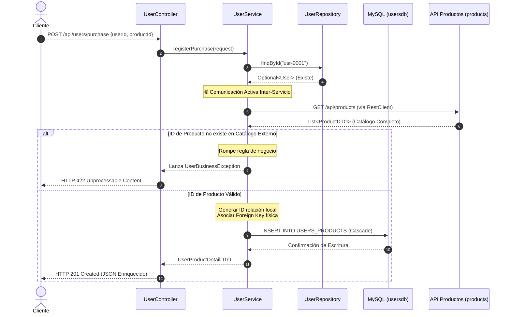
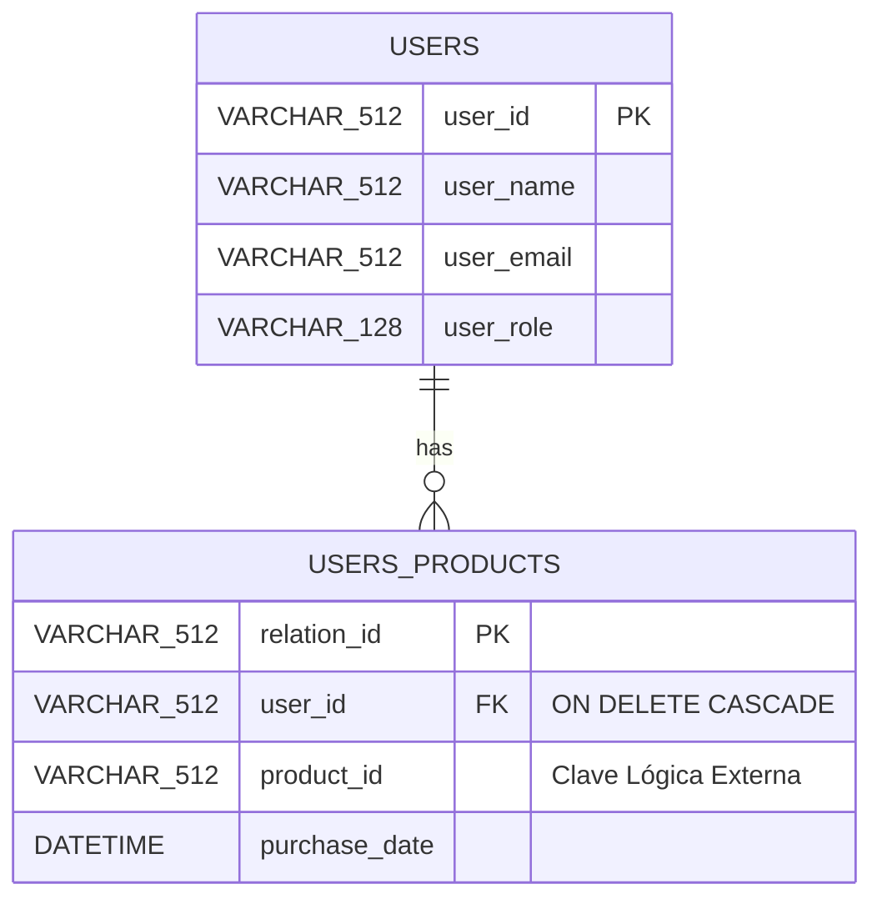

# 👥 Microservicio: Gestión y Agregación de Usuarios (`users`)

Este componente es una aplicación independiente de Spring Boot 3.x diseñada para gestionar el dominio de usuarios y orquestar la agregación distribuida de compras consultando el catálogo del microservicio externo de productos a través de peticiones HTTP síncronas.

---

## 🏗️ 1. Arquitectura y Topología de Red

El sistema opera bajo el patrón **Database-per-Microservice**. La aplicación de usuarios posee su propio servidor MySQL dedicado, aislando físicamente sus tablas y dependencias relacionales de la aplicación de productos.

```mermaid
graph TD
    subgraph 👥 Entorno Microservicio Usuarios [Puerto 8081]
        Client[📱 Resterm / Cliente REST] -->|GET /api/users/{id}/report| Controller[🌐 UserController]
        Controller --> Service[⚡ UserService]
        Service -->|JPA / Stored Procedure| Repo[🏛️ UserRepository]
        Repo -->|SQL / Puerto Interno 3306| MySQLUsers[(🐬 MySQL: usersdb)]
    end

    subgraph 📦 Entorno Microservicio Productos [Puerto 8080]
        AppProducts[Spring Boot: products]
        MySQLProducts[(🐬 MySQL: productsdb)]
    end

    %% Comunicación Distribuida
    Service -->|1. RestClient GET /api/products| AppProducts
    AppProducts --> MySQLProducts

    style Entorno Microservicio Usuarios fill:#f9f,stroke:#333,stroke-width:2px
    style Entorno Microservicio Productos fill:#bbf,stroke:#333,stroke-width:2px
```

### Diagrama de Secuencia: Validación y Escritura Distribuida (`POST /purchase`)
Este flujo describe la interacción de red requerida para registrar una compra garantizando la consistencia por software entre ambos servidores MySQL:



---

## 💾 2. Estructura de Base de Datos Local (`usersdb`)

La integridad referencial se mantiene de forma estricta a nivel local dentro de este servidor. La relación con la tabla externa de productos es puramente lógica a través de cadenas UUID.



---

## 📋 3. Guión Paso a Paso para el Laboratorio (Cheat Sheet)

Guía a los desarrolladores en la construcción del módulo de usuarios siguiendo esta secuencia:

### Paso 1: Configurar el Enlace de Red de Docker
1. Asegúrate de configurar los puertos internos nativos (`3306`) para las cadenas de conexión internas de Spring Boot.
2. Expón el puerto `3308` en el Docker Compose únicamente para inspección externa desde herramientas de la máquina física.

### Paso 2: Mapeo de Relaciones Locales con JPA
1. Diseña la entidad `User.java` y conéctala a `UserProduct.java` mediante una anotación `@OneToMany` bidireccional.
2. Añade las propiedades `cascade = CascadeType.ALL` y `orphanRemoval = true` para replicar el comportamiento `ON DELETE CASCADE` de MySQL.

### Paso 3: Optimización de Consultas (Evitar N+1)
1. En `UserRepository.java`, implementa una consulta personalizada utilizando la instrucción **`LEFT JOIN FETCH u.purchasedProducts`**.
2. Explica a la audiencia cómo esto mitiga la degradación de rendimiento cargando el grafo de objetos en un solo viaje de base de datos.

### Paso 4: Orquestación Síncrona Resiliente con RestClient
1. Configura el Bean de `RestClient` apuntando a la URL del contenedor de productos (`http://products:8080/api/products`).
2. En `UserService.java`, envuelve la llamada HTTP en bloques defensivos `try-catch` para aplicar un patrón de **Fallback** si el servidor de productos se encuentra caído, protegiendo la disponibilidad de la aplicación de usuarios.

---

## ⌨️ 4. Pruebas de Terminal Automatizadas (`users.http`)

Los desarrolladores pueden ejecutar las pruebas interactivas utilizando **Resterm** para verificar tanto los reportes unificados como los flujos de error controlado:

```bash
# Iniciar la interfaz en la raíz de la carpeta de usuarios
resterm users.http
```

### Endpoints Disponibles en el Módulo:
* **`GET /api/users/{id}/report`**: Genera la composición agregada del cliente, ejecutando el procedimiento almacenado local de conteo y resolviendo las etiquetas de productos consumidos vía HTTP.
* **`POST /api/users/purchase`**: Registra una nueva compra local siempre y cuando pase el filtro de catálogo distribuido.

---

## 📊 5. Umbrales de Calidad Exigidos (JaCoCo)

Al igual que en el módulo de productos, este repositorio cuenta con políticas de fallo en la compilación si no se cubren las ramificaciones lógicas de validación:

* **Cobertura de Líneas Mínima:** `80%` (Clases de Servicio y Controladores).
* **Cobertura de Ramas (Branches):** `70%` (Validaciones de existencia de usuarios y productos).

Para compilar, ejecutar tests unitarios/integración y generar la página web de métricas local:
```bash
mvn clean verify
```
